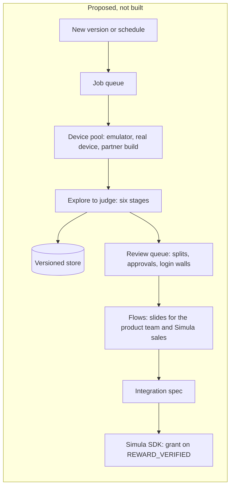

# simula-agent

Mobile app → product model → clickable mock, measured against the real screens → reviewed rewarded-ad proposals. This is Simula take-home #2. The assignment, word for word, is in [docs/ASSIGNMENT.md](docs/ASSIGNMENT.md). Every file format is in [docs/CONTRACTS.md](docs/CONTRACTS.md).

**Five-minute read:** [Start here](#start-here) · [Where each deliverable is](#where-each-deliverable-is) · [Results](#results) · [Decisions](#decisions) · [Productionization sketch (Goal 5)](#productionization-sketch-goal-5) · [What I'd build next](#what-id-build-next)  
**To run and check it:** [Replay without keys or a device](#replay-without-keys-or-a-device) · [What it does](#what-it-does) · [Run folders](#run-folders) · [Setup](#setup) · [Run it](#run-it) · [Money](#money) · [Safety and privacy](#safety-and-privacy)  
**Limits:** [Known limits](#known-limits) · [Not built, and why](#not-built-and-why)

## Start here

simula-agent takes an installed Android app and explores it. It writes down how the product works, rebuilds it as a clickable mock, and proposes rewarded-ad ideas (ads a user opts into for a reward). Two AI judges review the ideas. Nothing in the code is specific to one app. The five committed runs (2026-09-29) cost $51.50 in API calls.

- **Recording** (15:53, chapters and subtitles): [watch on Google Drive](https://drive.google.com/file/d/14EqJ6bC-ZbnR5EBgTJh3XkixH6aQBAag/view). 0:04 What this is · 1:19 One command, no keys, no phone · 3:18 Explore · 5:16 The product model · 6:41 Mock and QA · 8:08 Propose · 10:08 Judge · 12:01 Does it transfer? · 13:23 Running it for hundreds of apps · 14:40 What's next
- **Everything in one folder** (video, subtitles, the three decks as PDFs, and the clickable mocks zipped): [Google Drive](https://drive.google.com/drive/folders/1vMfZO18MmhWbsRr2KZ3SrDNaXFKnNdqw)
- **JanitorAI, the deep run:** [deck](runs/janitorai/20260929-203310-1f19585/flows/slides.pdf) · [clickable mock](runs/janitorai/20260929-203310-1f19585/qa/approved/index.html) (open it locally; GitHub shows HTML as source)
- **Coverage:** JanitorAI, Luzia, AOL and Perplexity ran all seven stages. JanitorAI's and Perplexity's explores are partial; JanitorAI's never reached a chat. AOL's mock drew 39 of its 64 screens. OOC stopped at launch on the emulator.
- **The main limitation:** neither of the two judge rubrics met its bar. So an accepted idea is two models' call, and a split (the judges disagree) waits for a person.
- **Evidence:** [Results](#results) · [Replay without keys or a device](#replay-without-keys-or-a-device)

## Where each deliverable is

The assignment's deliverables, in its words. Paths are JanitorAI's run; every run folder has the same layout, up to the stage it reached (OOC's stops at explore).

| Deliverable | Where |
|---|---|
| **Code**: explorer, mock generator, QA loop, proposer and judge, one command per stage | [`simula/`](simula/); the seven stages are in [`simula/stages/`](simula/stages/). Commands: [Run it](#run-it). Models, keys, emulator and services: [Setup](#setup). To run it with no keys or device: [Replay](#replay-without-keys-or-a-device). |
| **Product model**: what was explored, what was learned, how it's represented | [`model/product_model.md`](runs/janitorai/20260929-203310-1f19585/model/product_model.md) to read; every later stage reads `product_model.json`. What explore did: [`exhibits/01-explore.md`](runs/janitorai/20260929-203310-1f19585/exhibits/01-explore.md). |
| **Mock + QA evidence**: the recreation, and the QA loop's diffs and corrections | The mock: [`qa/approved/index.html`](runs/janitorai/20260929-203310-1f19585/qa/approved/index.html) (open it locally). Each QA round (`qa/round0` to `qa/round2`) has, per screen, the real screenshot, the mock's render and a difference heatmap. From round 1 on, a round also has the critic's notes on the best version so far (`critique.json`) and the fixer's edits (`edits.json`). QA keeps the round that measured best. Example, the paywall: [real](runs/janitorai/20260929-203310-1f19585/qa/round2/real/s16.png) · [mock](runs/janitorai/20260929-203310-1f19585/qa/round2/mock/s16.png) · [heatmap](runs/janitorai/20260929-203310-1f19585/qa/round2/heatmap/s16.png). Summary: [`exhibits/04-qa.md`](runs/janitorai/20260929-203310-1f19585/exhibits/04-qa.md). |
| **Rewarded flows**: the slides, and the judge's scores and reasons for every idea, rejected ones included | The deck: [`flows/slides.pdf`](runs/janitorai/20260929-203310-1f19585/flows/slides.pdf). Every idea's gates, scores and reasons: [`exhibits/06-judge.md`](runs/janitorai/20260929-203310-1f19585/exhibits/06-judge.md). The raw verdicts are in `judge/verdicts/`. |
| **Trajectory**: what ran on its own, where it failed, what was fixed by hand, how decisions were made | [`trace.jsonl`](runs/janitorai/20260929-203310-1f19585/trace.jsonl): one line per decision or model call, with who decided (code, a model or a person), tokens and $. `explore/actions.jsonl`: every tap. [`needs-human.md`](runs/janitorai/20260929-203310-1f19585/needs-human.md): every point where the run stopped or came out partial, why, and the command to continue. Hand fixes: none in the committed runs ([Results](#results)). One readable page per stage: [`exhibits/`](runs/janitorai/20260929-203310-1f19585/exhibits/). |
| **Recording** | Linked in [Start here](#start-here). |
| **Productionization sketch** (Goal 5) | [Productionization sketch (Goal 5)](#productionization-sketch-goal-5), and the full sketch in [docs/GOAL5.md](docs/GOAL5.md). |
| **What was spent** | [Money](#money): $51.50 for the five committed runs. Every call's $ is in its run's `trace.jsonl`. |

## Results

| App | Why it's here | What happened | Screens | Ideas accepted | API $ | Time |
|---|---|---|---|---|---|---|
| JanitorAI | the deep run | All 7 stages. Explore is partial: it never reached a chat. | 20 | 2 of 8 | $15.15 | 50 min |
| Luzia | checks the system transfers | All 7 stages. | 15 | 3 of 10 | $10.69 | 30 min |
| AOL | checks the system transfers | All 7 stages. The mock drew 39 of 64 screens before its budget ran out. Nothing was accepted, so the deck shows the closest idea. | 64 | 0 of 9 | $20.93 | 93 min |
| OOC | checks the system transfers | The app detected the emulator and closed itself, so there was nothing to model. | 1 | — | $0.00 | 15 s |
| Perplexity | never built or tuned against | All 7 stages. Explore is partial. Nothing was accepted, so the deck shows the closest idea. | 13 | 0 of 4 | $4.72 | 27 min |

Every run used commit `1f19585` and is committed with its cache of model replies, so it replays. The closest idea is the top split, drawn when none is accepted and labelled not a recommendation.

<details>
<summary><b>Full detail per run</b>: QA numbers, ideas split or dropped, relaunches, judge-2 fallback</summary>

| App | Why it's here | Budget | Run | Outcome | Screens | Ideas: proposed → accepted / split / rejected | API $ | Wall time | Judge-2 fallback used |
|---|---|---|---|---|---|---|---|---|---|
| JanitorAI | the deep run | `deep` | `runs/janitorai/20260929-203310-1f19585/` | All 7 stages done. Explore is partial and never entered a conversation: it used its 3 relaunches and stopped at 41 of 80 actions (see Known limits). The deck draws the 2 accepted ideas; 2 split ideas wait on Needs your call. QA approved: 488 of 488 tagged elements within 4 dp, 14 of 14 taps land, 6 of 6 core flows walk. | 20 (explore partial, relaunch limit) | 8 → 2 / 2 / 4. Code dropped all 4: 3 duplicates and 1 claiming a paying-user benefit never observed. Both accepted ideas passed after one revision. | $15.15 | 50 min (explore 13) | no |
| Luzia | checks the system transfers | `transfer` | `runs/luzia/20260929-204554-1f19585/` | All 7 stages done. The deck draws 3 ideas. QA partial: 198 of 198 tagged elements within 4 dp and 19 of 19 taps land, but 1 of 6 core flows fails, because the mock's chat screen has no text field. | 15 (explore complete, 40-action cap) | 10 → 3 / 2 / 5. Code dropped 1 of the 5 as a duplicate. 3 ideas were revised once. | $10.69 | 30 min (explore 7) | no |
| AOL | checks the system transfers | `transfer` | `runs/aol/20260929-205304-1f19585/` | All 7 stages ran. Nothing was accepted, so the deck draws one idea, c07, labelled as the closest idea and not a recommendation. The other 3 splits wait on Needs your call. Mock and QA are partial, for three reasons printed at the top of the deck: the mock left 25 of 64 screens undrawn to stay within its $ budget; core flows f2 and f6 go through undrawn screens; and the QA review stopped early because a model's answer was cut off. QA on the drawn screens: 699 of 700 tagged elements within 4 dp, 12 of 12 taps land, 3 of 6 core flows walk. | 64 (explore complete, 40-action cap; a news app, so every article is a screen) | 9 → 0 / 4 / 5. Code dropped all 5 as duplicates, one of them after a revision. | $20.93 | 93 min (explore 30) | no |
| OOC | checks the system transfers | `transfer` | `runs/ooc/20260929-212755-1f19585/` | Blocked by the app. OOC showed its own "Emulator Detected" dialog ("Not allowed to launch the App on android emulator, app will get closed.") and closed itself. Explore stopped with 1 screen and 0 actions. There was nothing of OOC to model, so stages 2–7 didn't run. *(Corrected 2026-09-29 21:55: an earlier version of this row said the phone showed the previous app and that the record didn't show the cause. The captured screen, `explore/states/s01`, is OOC's own dialog.)* | 1 (OOC's "Emulator Detected" dialog) | — | $0.00 | 15 s | — |
| Perplexity | extra transfer evidence, outside the test set: nothing was built or tuned against it | `transfer` | `runs/perplexity/20260929-212810-1f19585/` | All 7 stages done on a partial explore: it used its 3 relaunches, and its core-loop pass found no core action. Nothing was accepted, so the deck draws the top split, c01, labelled as the closest idea and not a recommendation. The other 2 splits wait on Needs your call. QA approved: 91 of 91 tagged elements within 4 dp, 2 of 2 taps land, 4 of 5 core flows walk. | 13 (explore partial, relaunch limit) | 4 → 0 / 3 / 1. The rejected idea depends on a busy queue the explore never saw, so both judges failed it on evidence. | $4.72 | 27 min (explore 10) | no |

- **4 dp:** 4 density-independent pixels, about 1/40 inch.
- **Judge-2 fallback used:** whether the trace has a `declared fallback used` line (see Setup).

**OOC** runs with the same command as every other app. The fix is a real device (the device pool in [docs/GOAL5.md](docs/GOAL5.md)).

</details>

**Hand fixes.** A person stepping in during a run is a `hand_fix` line, decided by `human`, in the run's `trace.jsonl` (`simula note --run ID`). No committed trace has one. Two earlier JanitorAI attempts are not committed:
- The first failed after its tour, when a screenshot timed out under heavy host load; the emulator then crashed.
- The second was stopped at once, because the restored emulator had JanitorAI logged out.

Aadi logged JanitorAI back in by hand before the committed run.

## What it does

Given an Android app on an emulator, the pipeline explores it and writes a product model: screens, flows, and money mechanics such as paywalls, limits, currencies and ads. It draws the relevant screens as a clickable HTML mock and repairs the mock against the real screenshots. It proposes rewarded-ad ideas that fit the app's own economy, has blind judges review them, and turns the drawn ones into slides for the app's product team.

The rewarded interaction is always a short sponsored game, because that is Simula's ad unit (a playable). What changes from idea to idea is the moment, the placement and the reward. Code records the facts and makes every decision it can check. Models interpret, and code checks their answers against the capture where it can.

| Stage | Purpose |
|---|---|
| `explore` | Drives the app through mobile-mcp, an emulator-control tool. Records every distinct screen, the tap graph, full-size screenshots and element trees (each element's text and position). Then repeats the app's core action to measure the free experience (the core-loop pass). |
| `model` | Turns the capture into `product_model.json`. Code writes the facts. One model call adds the meaning (names, purposes, flows, mechanics, content ratings), keyed to those facts. Code checks cited IDs, quoted UI text and connected edges; the meaning itself can be wrong. |
| `mock` | Draws the screens in scope as one clickable HTML page, in parallel batches, reusing pictures cropped from the screenshots. |
| `qa` | Scores each mock screen against its screenshot on element positions, navigation, and masked SSIM (a structural-similarity score where 1 means identical, ignoring parts that change between visits). A critic explains the gaps, a fixer edits the page, and the best round goes to `qa/approved/`. The three results are reported separately, with no pass mark. |
| `propose` | One model call per lens (a point of view, such as a subscriber's) proposes rewarded-ad ideas. Code checks each idea against the product model, adds a cost line, and ranks them. |
| `judge` | Blind judges score every idea on gates (hard rules) and judgment checks. Code turns their verdicts into accept, reject, conditional (the judges split, so the idea waits on Needs your call) or needs-human. A fixable reject gets one revision. |
| `flows` | Adds each drawn idea's new screens (at most 4 ideas) to a copy of the approved mock. Taps through every step in Playwright and writes the product team's deck (`slides.html`, `slides.pdf`) and, apart, Simula's review (`review.html`, `review.pdf`: run notes, every idea's score, Needs your call). |

## Replay without keys or a device

Every committed run replays with no API keys, no emulator and no model calls. You still need Chromium, because mock, qa and flows render pages. One command checks every run and leaves your checkout as it was:

```sh
git clone https://github.com/AAdityaisme/simula-agent && cd simula-agent   # on a Mac, clone outside ~/Desktop (iCloud)
uv sync
uv run playwright install chromium
uv run simula replay-check                     # or one app: uv run simula replay-check janitorai
```

It replays each run in a throwaway clone of the commit it's pinned to in [`runs/PINS.toml`](runs/PINS.toml) (HEAD when it has no pin), with the keys removed and outside requests refused. It prints one line per run and exits 1 if any run doesn't replay as committed. It checks that plain `--replay` skips every finished stage, that `--from model --replay` writes the same JSON outputs, and that HEAD still holds each run and every cache entry its pin had. `tests/test_replay.py` runs the same checks. Renders (PNG, PDF) differ byte by byte across machines, so it doesn't compare them.

To re-execute a run in place, check out its pin and run the replay yourself. This rewrites timestamps, the trace and the renders in the run folder, so `git status` shows changes afterwards.

```sh
git checkout submitted-2026-09-30
uv run simula run janitorai --run 20260929-203310-1f19585 --budget deep --from model --replay
uv run simula run luzia --run 20260929-204554-1f19585 --from model --replay
uv run simula run aol --run 20260929-205304-1f19585 --from model --replay
uv run simula run ooc --run 20260929-212755-1f19585 --from model --replay
uv run simula run perplexity --run 20260929-212810-1f19585 --from model --replay
```

Replay reproduces on macOS, where these runs were recorded, not yet on Linux (see [Known limits](#known-limits)).

- `--from model --replay` re-runs every stage from model to flows, taking every model reply from `cache/`. Explore drives the device and can't replay, so its capture comes from the run folder. A call that isn't in the cache stops the run with exit code 4 instead of calling an API.
- Plain `--replay`, with no `--from`, skips every stage whose inputs, prompts, settings, code and outputs still hash the same as when it finished. (A hash fingerprints the contents.) On a finished run at this commit, it reruns nothing.
- A replay stops at the first stage the run never finished, says so, and exits 0. A run that stopped at explore (an app that refused the emulator) replays explore alone.

## Run folders

Each run lives in `runs/<app>/<run_id>/`:
- `<stage>/` holds each stage's output, plus `done.json` or `failure.json`.
- `manifest.json` records the git sha, profile, budget, models, prompt hashes, tool versions, provenance (where the run's inputs came from), and total spend.
- `trace.jsonl` has one line per decision or model call.
- `exhibits/NN-<stage>.md` is a readable summary of each stage.
- `needs-human.md` appears only when a person has to act.

`runs/<app>/latest` points at the newest run. The full layout is in docs/CONTRACTS.md.

## Setup

You need:
- macOS or Linux
- Python 3.12 and [uv](https://docs.astral.sh/uv/)
- Node 20+
- For `explore` only: an Android emulator at 1080 × 2400 px and 420 dpi (the `Device` in `simula/contracts.py`), with the apps in `config/apps/` installed (`aol`, `janitorai`, `luzia`, `ooc`, `perplexity`), and `adb` on the path or `ANDROID_HOME` set.

```sh
uv sync
npm ci                              # mobile-mcp: @mobilenext/mobile-mcp 1.0.5, pinned in package.json
uv run playwright install chromium  # Playwright 1.63.0, pinned in pyproject.toml
cp .env.example .env                # then fill in the keys below
uv run simula doctor                # free preflight: packages, mobile-mcp, Chromium, emulator, apps, keys present
uv run simula doctor --keys         # also makes one tiny call per model (about a cent)
```

**Once, after installing the apps,** compile them ahead of time (a few minutes per app). On a busy emulator, an app's first cold start can outlast Android's limit, so Android kills it as not responding before explore sees a screen. In a rehearsal, Android killed Perplexity on 3 of 3 launches until it was compiled; afterward it started in 9 s.

```sh
for pkg in $(sed -n 's/^package = "\(.*\)"/\1/p' config/apps/*.toml); do adb shell cmd package compile -m speed -f "$pkg"; done
```

On a Mac with iCloud Desktop sync, the error `No module named 'simula'` means iCloud hid `.venv`, and Python 3.12.2+ skips hidden `.pth` files. Run `chflags -R nohidden .venv`, or clone outside `~/Desktop`.

Set these in `.env`, by name:

| Name | Needed for |
|---|---|
| `ANTHROPIC_API_KEY` | Every Claude call: Opus 5.5, Sonnet 5.5, Haiku 4.5 (`dev` profile). |
| `OPENAI_API_KEY` | Judge #2: gpt-6-sol. If a call errors or times out on both tries, it moves to gpt-6-luna, and its trace line says `declared fallback used`. Both judges score every idea (`judges` in `config/profiles.toml`). |
| `TYPESAFE_API_KEY` | Jev (`jev-latest`), which ranks the explorer's next tap in the `real` profile. |
| `SIMULA_REDACT` | Explore. A comma-separated list of the emulator account's handle and names. See Safety and privacy. |

`SIMULA_REDACT` works at capture time. Explore replaces each listed string (in any case), and every email address, with `[redacted]` in the element trees it captures. It also paints over those elements in its screenshots before anything is saved. Explore refuses to start while `SIMULA_REDACT` is empty.

Tests:

```sh
uv run pytest -m "not live" -q      # offline, what CI runs; plain `uv run pytest` does the same
uv run pytest -m live               # real API calls and the emulator; a few cents
```

## Run it

`APP` is a file name in `config/apps/`. A stage command works on the run given by `--run ID`, or else on `runs/<app>/latest`. It starts a new run only when the app has none.

```sh
uv run simula explore janitorai                 # add --new for a fresh run folder
uv run simula model janitorai
uv run simula mock janitorai
uv run simula qa janitorai
uv run simula propose janitorai
uv run simula judge janitorai
uv run simula flows janitorai

uv run simula run janitorai --new               # all seven stages in a new run
uv run simula run janitorai --from qa           # rerun qa and everything after it, in the latest run
```

Reruns:
- A stage command always reruns its stage.
- `simula run` skips a stage whose inputs, prompts and settings still hash the same as when it finished. With `--from`, it reruns that stage and every one after it.
- Explore is the exception. `simula run` reuses a captured explore as it is, complete or partial with later stages built on it, even under a different `--budget`. No other stage hashes the budget, so a budget change alone reruns nothing. `--new` or `--from explore` explores again.
- A stage refuses to start when a stage it reads from isn't done.

| Flag | Effect |
|---|---|
| `--profile real\|dev` | `real` (the default) uses the models in `[real.roles]` of `config/profiles.toml`. `dev` uses cheaper models and lower effort. |
| `--budget deep\|transfer` | Exploration size. `transfer` (the default) is 40 actions or 12 minutes; `deep` is 80 actions or 25 minutes. On a run that already has an explore, a new budget takes effect only with `--new` or `--from explore`. |
| `--no-send` | Explore skips the core-loop pass and sends no chat messages. `explore` and `run` only. |
| `--device SERIAL` | The emulator to explore on (default: `ANDROID_SERIAL`, else the only device online). `explore` and `run` only. |
| `--new` / `--from STAGE` | Start a new run folder; rerun from a stage onward (`run` only). |
| `--replay` | Cache only: no model calls, no device. A cache miss stops with exit code 4. |
| `--no-cache` | Skip cache reads; replies are still written. |
| `--usd-cap USD` | Override this stage's $ cap. |
| `--allow-account-create` | Saved with the run's settings, but nothing uses it yet. The explorer never creates an account, and its deny-list blocks sign-up taps. |

**Fixtures** (saved test inputs). `--allow-fixtures --fixture STAGE=PATH` fills one stage folder of a new run from a fixture, so later stages can run without the earlier ones:

```sh
uv run simula run janitorai --new --allow-fixtures --fixture model=tests/fixtures/golden/janitorai --from mock
```

Fixture runs are test data only:
- The run id ends in `-fixture`, exhibits carry a banner, and the slides carry a watermark.
- A stage refuses fixture input without `--allow-fixtures`.
- A fixture can only seed a run that the same command creates.

Exit codes:
- **0:** done, partial stages included; `needs-human.md` says what's missing.
- **1:** `simula replay-check` found a run that doesn't replay as committed.
- **2:** a fixture was refused, `simula replay-check` matched no committed run, or `simula explore` refused to replace the explore that later stages of the latest run were built on (add `--new`, or `--run ID`).
- **3:** a command that isn't built (`compare-rankers`).
- **4:** a $ cap stopped a stage (`needs-human.md` has the command to continue), or `--replay` missed the cache.
- **5:** the model provider is refusing calls (a usage limit or an outage).

## Money

Each stage has a $ cap in `config/profiles.toml` (`[caps_usd]`). Override one with `--usd-cap`.

| explore | model | mock | qa | propose | judge | flows | total | validation |
|---|---|---|---|---|---|---|---|---|
| $3 | $4 | $25 | $12 | $6 | $8 | $8 | $66 | $20 (`validation_usd_cap`) |

- **Before each model call,** code reserves that call's worst case: the estimated input plus the maximum output tokens. If the stage's spend in this run, plus calls in flight, plus this call could pass the cap, code refuses the call and the trace says so. The stage stops, writes `needs-human.md`, and exits 4. A stage that can go on without that call (flows, one idea at a time) finishes marked partial instead, with the command to rerun it under a higher cap.
- **Every model call** writes a line to `trace.jsonl` with its model, tokens, $ and cache key. A cache hit costs $0. A failed call is charged for what it used. `manifest.json` keeps the run's `usd_total`.
- **Spend outside a run:** `uv run simula note "what I fixed by hand" --usd 0.40` adds a line to `build/trace.jsonl`. With `--run ID`, it goes into that run's trace as a hand fix.
- **`caps_usd` in `manifest.json`** copies `[caps_usd]` at run creation. A stage runs under `--usd-cap` if given, else under `[caps_usd]` as it is then. So a later rerun may have had a different cap than the manifest shows. Its spend is in its trace lines either way.

**Spend.** The committed runs cost $51.50 in API calls, summed from their traces: JanitorAI $15.15, Luzia $10.69, AOL $20.93, Perplexity $4.72, OOC $0.00. The two earlier JanitorAI attempts, not committed, cost $0.40 in explore calls. Writing and reviewing the code ran on Claude Max and ChatGPT subscriptions, which aren't billed per call.

## Safety and privacy

- **Deny-list.** Explore never subscribes, buys or signs in. Code blocks any tap whose text matches the deny-list in `simula/device/observe.py`. Each blocked tap is logged in the trace and counted in the explore exhibit. The list includes:
  - subscribe, buy, pay, purchase, restore, confirm, and "start … trial"
  - sign in or up, log in or out, and create account
  - delete, report, block, permission prompts, post, and more
  - on an upsell screen, its call-to-action words too (continue, try, start, get, claim, unlock, …)
- **Play billing BACK.** If Google Play's billing screen (`com.android.vending`) comes to the front, explore presses BACK before anything else runs.
- **Sending.** The core-loop pass sends a few neutral chat messages (3 on `transfer`, 8 on `deep`) to measure the free experience. Gifts, coins, gems, tips and credits stay blocked. `--no-send` skips the pass.
- **Content filter.** Explore looks for the app's content or safety filter (for example "SFW only" or "Hide NSFW") and picks its most restrictive option.
- **`content_rating`.** The model stage rates every screen safe, mixed or unsafe. A generic adult-keyword list (`[content]` in `config/profiles.toml`) can only raise a rating to unsafe. The proposer and the judges see an unsafe screen's id, name and rating, but none of its text. An idea may only trigger on a screen rated safe or mixed.
- **Redaction at capture.** `SIMULA_REDACT` (see Setup) hides the account's handle, names and email addresses before anything is saved.
- **Mock scope.** An unsafe screen stays out of the mock, unless leaving it out would break a core flow. In the slides, card art from any screen not rated safe is blurred wherever it is drawn.

## Decisions

Three decisions carry the design:

1. **Only the package name is per-app.** One command runs JanitorAI, Luzia, AOL, OOC and Perplexity. When the general rule costs one app something, that app takes the loss.
2. **Code checks the evidence; models interpret it.** Code checks cited IDs, quoted UI text and connected edges, and drops an item that cites something it never recorded. What a screen means is a model's reading, and that reading can be wrong. The judges' evidence check backs it up.
3. **Proposals are reviewed, and the uncertainty stays on the page.** Five hard gates, then seven judgment checks, scored by two judges from two providers. Accepted ideas get full flows. Split ideas wait for approval on one "Needs your call" page. If none is accepted, the top split is drawn as the closest idea, labelled not a recommendation. **The judge failed its own bar:** neither rubric met the adoption bar, which was set after seeing earlier rounds' failures. Each let only 1 of 4 known-good ideas through both judges cleanly (`validation/report.md`).

<details>
<summary><b>All ten decisions: why, and what each one gave up</b></summary>

| # | Decision | Why | What it costs |
|---|---|---|---|
| 1 | **Nothing is tuned to one app.** The only per-app config is the package name. Content filters, content rating and budget are run flags that work the same on every app. | The system should be able to open any app, understand it, mock it and propose for it. Tuning to the test apps would make the demo look better and the system worse. | When the general rule costs one app something, we take the loss (a Luzia screen and an AOL screen stay out of their reference mocks). |
| 2 | **Every deliverable comes from a real explore run.** Fixtures and hand-built reference models are test data. A real run refuses them. | A deck built on hand-made input proves nothing about the explorer. | An app gets deliverables only as fast as a phone can explore it. |
| 3 | **One app deep, the rest to show it transfers.** JanitorAI gets the deep run. Luzia, AOL and OOC check transfer. Perplexity is extra evidence: an app nothing was built or tuned against. | Deep on one app beats shallow on five, but one app alone can't show the system is general. | An app that detects the emulator and closes gets a recorded run, with no workaround. Getting past emulator detection isn't this system's job. |
| 4 | **The mock draws the screens the model stage scoped, in parallel batches, admitted in priority order against its cap.** Each batch's call holds its worst case while it runs and gives back what it didn't spend. Once the cap turns a batch away, no later batch is asked for. | The mock is half the cost of a run ($10.35 of $19.84 on a development JanitorAI run). A cap checked one call at a time can be blown by batches running at the same time. | Screens outside the scope aren't in the mock. |
| 5 | **The judge has hard gates, and a split goes to a person.** Five gates must all pass: policy, no cash rewards, no chat content, nothing free taken away, and brand safety. The judges score seven judgment checks. An idea that fails something fixable gets one revision and is judged again from scratch. If the judges split on a judgment check, the idea isn't drawn. It goes on one "Needs your call" page in Simula's review (`flows/review.pdf`), with the open question, both judges' reasons and its "To approve" entry. A person draws it by adding that entry to `promote` in `flows/approvals.json`, and leaves any idea out by adding its id to `hold`; every idea the file doesn't name follows the judges. An older file's `approved` list is read as `promote`. When nothing is accepted and no one promotes a split, the top-ranked split gets full slides, labelled as the closest idea and not a recommendation; a held closest idea gets no replacement. | One overall model score lets a good-sounding idea through on charm. Gates make the lines that can't be crossed explicit. | More ideas get rejected or held back, and a person decides the held ones from one page. |
| 6 | **An idea that uses an app term we never saw explained is flagged and kept. The judge never sees the flag.** | Dropping it threw away good ideas. Showing the flag to the judge would bias the verdict. The flag is for the person reading the deck. | A flagged idea can reach the slides; its flag is on its appendix card. |
| 7 | **The cost check is a mark and never a verdict.** Code estimates what the reward costs the app to serve, and the ad rate at which it pays for itself. A result other than PASS is shown on that idea's slides and in the appendix, and so is a reward that may give away something the app could sell ("May lose a sale"). It never blocks the idea, changes its verdict or moves it in the ranking. | From outside the app we don't know its real serving costs or ad rates, so a hard cost rule would reject ideas on guesses. | An idea that might lose money can still be accepted. The mark is how the reader sees that. |
| 8 | **Two judges from two providers, and the stricter rubric, adopted without passing its bar.** Judge 1 is Claude Sonnet 5.5. Judge 2 is OpenAI gpt-6-sol, with gpt-6-luna as its traced fallback (see Setup). Both score every idea. We tested two rubrics on 22 planted defects (ideas broken on purpose) and 4 ideas picked as good. The bar was written down after earlier rounds had failed. **Neither rubric met it:** each let only 1 of the 4 good ideas through both judges cleanly. We adopted the newer, stricter rubric because, with both judges pooled, it was equal or better on every line we measured. Judge 1 alone caught all 22 planted defects. Judge 2 alone caught 20, and missed both planted defects for the "specific to this app" check. The stricter rubric also rejects JanitorAI's "boost a small creator" idea, where the player gets nothing and other creators lose list places. | One model family grading its own family's output is the weakest check there is. | Judge 2 is strict on evidence: it failed that check on 3 of the 4 good ideas. So a good idea can end up on the "Needs your call" page instead of getting full slides. Three of the stricter rubric's clauses were written after seeing the failures. All of it is in `validation/report.md`. |
| 9 | **The slides are for the app's product team.** Each drawn idea gets two slides: its flow step by step on the app's own screens, then why it works, in plain words with arrows and short callouts. Judge scores, cost assumptions and evidence ids go in a separate document for Simula's review, `flows/review.pdf`. Engineers get `candidates.json`. | The people who'd say yes to an ad placement are product people, and they won't read an information dump. | The reasoning lives in that second document, so a product team reading only the deck doesn't see it. |
| 10 | **Each stage stops and resumes on its own; people restart earlier stages, code doesn't.** Every stage writes a done file with hashes of its inputs, prompts, settings, code and outputs. It is skipped only when all of them match. A captured explore is reused as it is until `--new` or `--from explore`. A spend cap, a login wall or a provider outage stops the run with a note saying what a person needs to do. | Many steps here are probabilistic, so a failure has to stay inside its stage: you know which stage went wrong and restart from there. | A person steps in more often. During a development run, an API usage limit stopped QA, and it was re-run by hand once access came back. |

</details>

## Productionization sketch (Goal 5)

This service is proposed and not built. Today there is the single-run command-line tool, with per-stage $ caps, traces and one lock per emulator. The full sketch is in [docs/GOAL5.md](docs/GOAL5.md).



- **Storage and versioning.** The service would keep one never-overwritten folder per app, platform, version and run. It would compare two versions screen by screen, on the fingerprint the explorer already computes.
- **When to re-explore.** On a new app version: iOS has a public version lookup, and on Android the service would read the installed version after each run. A slow scheduled rerun would also catch changes made on the server. A re-visit would replay the recorded taps and explore only the screens that changed.
- **Where people review.** Login walls and age gates; ideas the judges split on (the "Needs your call" page in `flows/review.pdf`); judge calls that failed twice (`judge/human-queue.md`); and approving which ideas go to the app's product team. A single run raises the first three today, in `needs-human.md`, `flows/review.pdf` and the judge folder. The service would gather them in one review queue.
- **Cost per app.** The four full runs of 2026-09-29 cost $4.72 to $20.93 each in API calls (per app in [Results](#results)), plus 7 to 30 minutes of emulator time to explore. The mock is the biggest share, 43% to 55% of each run. So the lever at scale would be redrawing only the screens an update changed. The idea stages alone (propose, judge, flows) cost $1.14 to $4.01 per app and need no phone, so re-proposing for an app already modeled is cheap. Under an assumed 15-minute review (about $12.50), a person's review costs about as much as a run. The per-stage breakdown of one development run is in docs/GOAL5.md.
- **Plugging into Simula.** The slides would be the sales artifact. An accepted idea maps onto the rewarded ad in Simula's native SDKs, which grant the reward on `REWARD_VERIFIED`. The deck's simulated ad does the same. The sketch's first table says what's built and what's only proposed.

## Known limits

The ones that matter most:

- **JanitorAI's deep explore never entered a conversation.** On each of three chat-history sheets (s18, s19, s20), its tap landed on a text field and was refused (steps 78, 81 and 84 in `explore/actions.jsonl`). Explore refuses an `EditText` outside its core-loop pass (`simula/device/observe.py`). None of the 20 screens is a chat. So every JanitorAI idea rests on the paywall's copy ("5× context", "priority routing"). It never saw a chat limit, as the model's first open question says. This is the first explorer fix.
- **JanitorAI's home feed was recorded as several screens.** The feed shows different characters each time it loads. So after a relaunch, explore didn't match it to the home screen it had (s01) and recorded new ones (s13, s15). It then spent two of its three relaunches trying to reach one of those copies ("no recorded way … to s13" in `exhibits/01-explore.md`). That is why the deep run stopped at 41 of 80 actions. The fix is to match a screen by its fixed parts (top bar and tabs) instead of its changing content.
- The judge failed its adoption bar on a small, reused set (4 known-good ideas, 22 planted defects), with no human labels. Its verdicts are two models' unvalidated opinion.
- The committed runs' decks mix two audiences: the idea slides are for the app's product team, and the cover's run notices ("the mock left screens undrawn: s39, s40…"), the score table and Needs your call are Simula's review. Flows now writes them apart: `flows/slides.pdf` for the product team (the cover and the idea slides) and `flows/review.pdf` for Simula (the run notices, the score table and Needs your call). The committed runs predate that. The idea slides still carry review chips ("Cost check: CONDITIONAL", "Reach scenario").
- The cost check compares what one ad view earns with what the reward costs to serve. It counts a lost sale only when the reward is something the app was seen selling at a price. It doesn't ask what the app could charge for the same benefit. Luzia's accepted "feature your app for 24 hours" ideas (c06, c08-rev) give away visibility the app could sell as a paid boost or a creator subscription. The check marks them PASS because they cost nothing to serve. The fix is a check that asks whether the reward is something the app sells or could sell, and prices it against that. Aadi overrules the judges on c06 and c08-rev for this reason. *(2026-09-30, on `next`: the cost mark now flags a reward that gives part of a paid benefit, priority or visibility over other users, or currency, with no price counted: "may give away something the app could sell". It flags c06 and c08-rev. It is a flag beside the mark, not a price, and never changes a verdict or the order.)*
- The committed runs replay only on macOS, where they were recorded. Their code keyed each image in the cache by its PNG bytes, and Linux writes different PNG bytes for the same pixels, so every lookup there misses. `simula replay-check` and `tests/test_replay.py` skip their grader's replay on Linux. From commit `22dbfac` on, model calls key images by their pixels, so a run recorded after it can hit its cache on Linux. Renders may still differ across machines, and QA sends Chromium renders to the model, so whether such a run replays past QA on Linux isn't shown yet.
- QA's keep score only picks the round QA keeps; it is not a fidelity percentage. Fonts and layered drawers are where the mocks visibly miss.

<details>
<summary><b>All other known limits (31)</b></summary>

- A closest-idea slide carries an unresolved split. It is drawn only because nothing was accepted, and it says so.
- An approval of a split holds only while the judges split on exactly the checks it names. If the disagreement changes, the idea goes back to a person.
- The Needs your call page prints each idea's raw approval snippet. Code strips element ids from a judge's reason, which can leave stray punctuation or a broken sentence in the Needs your call and Closest idea boxes (",,", "matches's", JanitorAI's "…3+ days old from. That element…", Perplexity's "backed by, and").
- The score table names the evidence check without quotes, so a reason reads "didn't pass backed by what was seen in the app".
- The duplicate check compares the benefit's name and who gets it. So two ideas that name their benefit differently can both be drawn: Luzia's deck has two that each feature a user's creation on Explore for 24 hours (c06, c08-rev). And because it ignores the moment, a timing or cohort variant is dropped as a duplicate: JanitorAI's memory offer to a free user closing the paywall (c01) was dropped as a duplicate of the come-back-after-three-days memory idea (c06).
- The judges pass promotion ideas that add a separate row, because nobody else moves down (Luzia's c06 and c08-rev). A new row still spends the same finite attention. The rubric counts what other creators lose but doesn't price attention, so a product team would likely cut these.
- No check weighs showing an ad to paying subscribers. JanitorAI's accepted c03-rev is offered only to Janitor Plus subscribers. Its cost mark is CONDITIONAL for a separate reason: at 8k tokens of context it pays for itself only above $13 eCPM (ad revenue per thousand views), against a $10.16 benchmark. *(2026-09-30, on `next`: a judgment check, `c3_spares_payers`, now fails an offer that sits inside what paying users pay for; one paying users see that is pitched as more of what their plan sells, or whose reward their plan already includes; or one an ad-free plan's members see. An offer only non-paying users see passes, even when its reward is a slice of the plan. Both judges fail c03-rev on it.)*
- A `declared fallback used` trace line means that judge-2 call ran on gpt-6-luna, which the validation never measured.
- The deck draws at most 4 ideas. Any survivor past the cap is scored and listed as not drawn, with no flow.
- A drawn reward confirms the grant and doesn't demonstrate the benefit. It is a confirmation screen ("10× memory is on", "Toki grew 1 step!"), or, where the mock can't show it working, a label on the screen that the caption calls a label. Broken interactions and undrawn screens are flagged openly on the slide.
- The model stage's evidence check catches ids and quotes that were never captured. It doesn't catch wrong readings of what a screen means.
- The paywall detector can fire on a sponsored price in a feed. AOL's explore recorded s05, an article with a Temu ad in its Taboola block ("jackets for $2.36"), as a paywall, and its core-loop pass stopped there. The model stage then noted that no upgrade screen was seen.
- The comment beside `judges` in `config/profiles.toml` still says a split "goes to a person". It goes to the Needs your call page.
- A config value the code reads but doesn't hash, such as the adult-keyword list, doesn't trigger a rerun when it changes.
- QA's measurement records in `cache/qa` are keyed by the page and its inputs, not by run. So two runs that draw the same page from the same inputs share one record.
- The deny-list is English only. The Play billing BACK works in any language, but covers Play purchases only.
- The mock copies its web fonts in when it's built, and renders refuse every outside request. A font that can't be fetched at build time is replaced by system fonts, and the trace says so.
- The mock draws 4 screens per batch, whatever their size, so a batch of dense screens can still run out of output tokens.
- The product model's map labels each arrow with the tapped element's text. So a tap on a character card writes the card's whole description onto the arrow: JanitorAI's map carries one in Japanese, and AOL's carries whole headlines. `product_model.json` stores the element separately, so later stages aren't affected. Shortening the label is a small change in `render_md` in `simula/stages/model.py`. It waits until after submission, because any change to that file makes every committed run's `--replay` redo the model stage, and for JanitorAI and AOL every stage after it.
- A picture found only by the vision pass gets a name, and a named element isn't cropped. So JanitorAI's profile picture (s05) has no crop, and the mock draws a stand-in. The fix is to crop vision-found pictures whatever their name, in `is_image_like`, after submission for the same reason.
- Art detection counts distinct colors, so a flat-shaded illustration with few colors isn't cropped as a picture.
- A count badge drawn over a picture in the app can leave a strip on the cropped art.
- In QA, a screen with nothing to measure (no tagged element, no tap, too little unmasked screen) scores 0 and still counts in the round's mean.
- When the QA critic refuses a group of screens, that group gets no fixes that round, and the round stops if every group refuses. Code doesn't split the group to find and drop the refused images.
- The model stage names elements up to a naming budget. Past it, later screens' elements go unnamed.
- Propose ranks by reach: how many users can see the trigger screen, estimated from how deep it is, times the proposer's typed per-user `daily_cap`. Reach and the cost mark are scenarios from assumed rates. They are not a measured audience or advertiser ROAS (return on ad spend).
- The cost mark's break-evens compare against rewarded-video eCPMs from ad-network vendor data. They assume the publisher keeps the whole rate ("a publisher-net eCPM (share 1)"); Simula's own rate and revenue share would replace both. The serving-cost model is chat-shaped: Perplexity's "1 extra Computer task" is priced as 10 replies of 300 tokens, far below what an agent task costs. *(2026-09-30, on `next`: an inference reward is priced as replies only when its unit names a reply, message, answer or response; otherwise the line says its serving cost isn't counted.)*
- Propose's "shown in a chat" check is a keyword match per clause, so it can miss cases, which are left to the judges' brand-safety gate.
- The judge's revision naming call (about $0.01) is traced under `propose`, so it counts toward propose's cap.
- When a streamed reply is cut off, thinking the API didn't stream back isn't charged.
- `simula compare-rankers` prints "not built yet".

</details>

## Not built, and why

| Not built | Why |
|---|---|
| Per-app code or config beyond the package name | The system has to work on apps it has never seen (Decision 1). |
| A way past emulator detection, or an iPhone driver | An app may refuse to run on an emulator; that run is recorded as it happened. Goal 5's answer is a real-device tier. |
| Automatic loop-back to an earlier stage | People restart earlier stages, by design (Decision 10). |
| A QA score that blocks flows | Nobody has measured what score is good enough, and blocking would leave an app with no slides. A QA that didn't finish is labeled `qa_incomplete`, and flows still runs. |
| A vector store or a database | A run folder of JSON files is enough at this scale. |
| A device pool and a job queue | One lock per device and `--device` let two explores run on two emulators. The rest is in Goal 5. |

## What I'd build next

- **An automated sign-in and sign-up phase.** Account creation was optional for this take-home, so the explorer never signs up. `--allow-account-create` is saved with a run but not acted on, and an app that opens on a sign-up wall stops for a person. Next is an opt-in phase, run before explore, that signs up or signs in with a test identity and hands explore a logged-in app.
- **Partner test accounts.** For an app that's a signed customer, its own test build and accounts (Goal 5's partner tier) reach the screens behind a login without creating anything.
- **A more realistic mock.**
  - For screens an idea doesn't change, use the captured screenshot as the base layer and draw only the new offer and ad on top. The trade-off: those screens are no longer generated, so they stop showing what the mock can rebuild.
  - Set each text's font size from its recorded element geometry. Today the builder model reads sizes off the screenshot.
  - Put the app's own character in the sponsored ad. The simulated ad card now shows a tile in the app's colors. Simula's unit is a playable with sponsored characters, and the proposer already writes how each idea uses one.
- **A walker on the live app.** QA compares the mock with the screenshots explore captured, and walks the mock's flows along explore's recorded taps. Nothing repeats those taps on the live app beside the mock. A walker that did would check the mock against the app as it is now.
- **Give the judge a human baseline.** About 15 blind human labels (`simula label`), and a measured fix for judge 2's strictness on evidence, tested on the same known-good ideas.
- **Redraw only what changed.** The mock is half of a run's cost, so an app update should redraw only the screens whose fingerprint changed.
- **Split the big modules.** Explore is about 2,100 lines, and mock and model about 1,000 each, with several responsibilities per file. Split them by responsibility, as flows already is.
- **The Goal 5 service.** A versioned store, the re-explore triggers, a review queue in place of `needs-human.md`, and a device pool with a real-device tier for apps that refuse an emulator.
