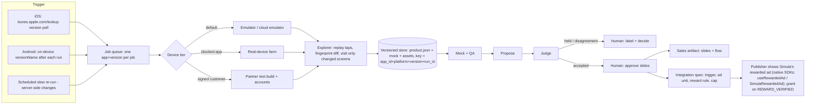

# Goal 5 — Productionization sketch: this system as a service across hundreds of apps

The assignment's Goal 5. Costs are measured from one development run's traces; outside facts carry the date they were checked; anything marked Proposed isn't built.

**Proposed service (not built).** Everything below describes a service that would run this system across hundreds of apps. What exists today is the single-run CLI; this table says which pieces are built.

**Implemented vs proposed:**

| Piece | Status |
|---|---|
| A cost line per model call in `trace.jsonl`; per-stage totals and `usd_total` in `manifest.json` | Implemented, on main |
| A $ cap per stage that stops the stage cleanly (`config/profiles.toml` `[caps_usd]`, `llm.Budget`, `CapReached`) | Implemented, on main |
| Picking the emulator (`--device SERIAL`) and one lock per device | Implemented, in the explorer (PR #11) |
| Pipelined scheduling, a device pool, a job queue | Proposed |
| Cloud device tiers (Device Farm, Firebase Test Lab, Genymotion) | Proposed: rates checked, nothing wired |
| Content-addressed storage (the 28 % of byte-identical copies) | Proposed |
| Redrawing only changed screens; a cheap re-visit instead of a full re-explore (§2) | Proposed, a sketch |
| A human review queue beyond `needs-human.md` | Proposed |
| The sales/integration handoff doc (§5) | Proposed, a sketch |

---

## One-pager: the proposed service (not built)



**1. Storage and versioning.** The service would keep one immutable folder per `(app_id, platform, app_version, run_id)`: `product.json`, mock bundle, asset files, manifest, never overwritten. Two versions would diff by comparing each screen's structural fingerprint (package/activity + element roles/IDs/bounds, text handled separately) — the same fingerprint the explorer already computes to tell screens apart within a run (`simula/device/observe.py`), reused as the cross-version diff key. Old raw screenshots would age out on a retention rule in code, not a cleanup agent.

**2. Re-explore triggers.**
- **iOS is queryable today, no key needed.** `https://itunes.apple.com/lookup?id=<appId>` is a live, public, unauthenticated JSON endpoint that returns a `"version"` field. Verified live 2026-09-27 against a real app (id 389801252) → `"version":"448.0.0"`.
- **Android has no equivalent public API.** Google has never shipped an official API for a third party to read another publisher's app version, and the Play Store's own listing page has flip-flopped on even *showing* it to humans — pulled in Aug 2022, restored after backlash (9to5google, 2022-08-04). The reliable signal is on-device, not the store: read the installed APK's `versionName` via ADB (`adb shell dumpsys package <pkg>`) right after each run. Authoritative regardless of what the store page does that week.
- **Cheap re-visit, not full re-explore:** replay the recorded taps with no model call, recompute fingerprints, send only changed/missing screens to the explorer.
- **Scheduled slow re-run** on a cadence catches server-side paywall/entitlement changes that never touch the binary version.

**3. Where humans review.** Three gates: (a) login/age-gate/CAPTCHA walls, (b) judge disagreements and held cases, (c) approving which accepted proposals become slides. A single run has (a) and (b) today, as `needs-human.md`, the deck's Needs your call page and `judge/human-queue.md`; (c) it doesn't have, since a run draws its accepted ideas without asking. The service would gather all three in one review queue. **Time-per-app is not sourced anywhere** — no vendor or paper gives a "minutes to review one app's slide deck" number, because this is Simula's own internal process. Treat any minutes figure below as an assumption to replace with a timed pass, not a researched fact.

**4. Cost per app: one development JanitorAI run (n = 1).**

*Corrected 2026-09-29. An earlier version of this section counted tokens for explore, model, propose and judge only, before any run was measured. It missed mock, QA and flows, which were $14.45 of the run's $19.84 (72.8 %). Its storage line (5–10 MB/run) and its bottom line (human review is the largest cost) were also wrong.*

```
cost_per_app = Σ over the seven stages (explore, model, mock, qa, propose, judge, flows):
                   Σ over model calls: tokens_in × price_in + tokens_out × price_out
             + device minutes (explore only) × device rate
             + storage GB × $/GB-month × months kept
             + human review minutes × loaded hourly rate
```

Token cost by stage, from development run `20260928-093155-a2a161c` (JanitorAI, profile `real`, budget `deep`; not committed, since its stages ran at two different commits). Each figure is the stage's sum of `usd` over its lines in `trace.jsonl`; the total equals `manifest.json` `usd_total` ($19.835857). Prices per million tokens come from `config/models.toml`: Opus 5.5 $4 / $20, Sonnet 5 and 5.5 $2 / $10, Haiku 4.5 $1 / $5.

| Stage | $ | Share | What it bought |
|---|---|---|---|
| explore | 0.07 | 0.4 % | 24 screens: 25 Sonnet vision calls and 19 Jev calls |
| model | 2.13 | 10.7 % | the product model, 2 Opus calls (the first failed validation, the retry passed) |
| mock | **10.35** | **52.2 %** | 22 screens in 6 Opus batches; $9.69 of it is output tokens, **$0.47 per screen** |
| qa | 1.90 | 9.6 % | 2 rounds, 12 Sonnet critics and 2 Opus fixers; score 9.12 → 9.41 |
| propose | 1.47 | 7.4 % | 5 Opus lenses and a Sonnet dedupe; 10 ideas → 5 distinct |
| judge | 1.72 | 8.7 % | 13 decisions by judge #1, plus 3 Opus revisions |
| flows | 2.19 | 11.1 % | 4 flows and the 51-page deck |
| **total** | **19.84** | 100 % | 57.5 min wall: explore 16.6, stages 2–7 40.9 |

| Term | Value | Status |
|---|---|---|
| Device | $0 on a local emulator; $2.82 on AWS Device Farm (16.6 min × $0.17/min); about $0.17 on Genymotion SaaS ($0.60/hr); $0 inside Firebase Test Lab's free 60 virtual min/day (about 3 explores), $1/hr after | Minutes measured (median of 13 real explores, 12.2–20.5 min). Rates as checked 2026-09-27; Genymotion's is from 2026-09-26 and wasn't re-checked. |
| Storage | 147 MB/run, 107 MB once byte-identical copies are removed; about $0.003 per run per month at $0.023/GB-month | Measured. PNGs are 89 % of it. About $7/month for 500 apps × 4 runs a year. |
| Human review | ~$12.50 | **Assumption, not sourced:** 15 min × an assumed $50/hr. Replace with a timed pass. |
| Judge #2 | not in this run | Unmeasured. Its calls cost about $0.03 each in the judge-settings rounds, so a 13-idea run adds well under $1 (an estimate). |

What this is: one historical run's traced API spend, with explore at a2a161c and stages 2–7 at integration fd6f293. It is not an invoice, not a four-app cost and not a production forecast, and n = 1. The run's manifest records mock's cap as $8.0, but the cap that bound mock was $15 from the live config, so `caps_usd` in a manifest is a snapshot, not what bound each stage. The committed runs' totals are in the README's Results table.

**Bottom line:** under an assumed 15-minute review, this run's API spend ($19.84) exceeds the estimated review cost (an assumed $12.50). The mock is half the token cost, and 94 % of that is output: the model writing HTML for 22 screens. So the cost lever at scale is how many screens get mocked, and redrawing only the screens an update changed. Explore costs pennies in tokens ($0.04–$0.11 over 13 real runs); what it costs is device time, about 17 minutes.

**Throughput:** only explore holds a device. Serially, as today's CLI runs, that is about 25 apps per emulator per day. Pipelined, with stages 2–7 running off-device while the next app explores, the ceiling is about 86, before app install, login and reset time, which were never measured.

**5. Sales / integration plug-in.**
- The mock + slides *are* the sales artifact — literally what the assignment describes Simula doing by hand today ("rebuild the relevant screens... mock the proposed changes"), now generated.
- The accepted proposal maps onto Simula's rewarded ad in its native SDKs (React Native `useRewardedAd`, Swift and Kotlin `SimulaRewardedAd`; `Simula-AI-SDK/simula-ad-sdk-react-native`, `-swift`, `-kotlin`, pushed 2026-09-26). **Simula's native SDKs document server-side reward verification:** the rewarded ad grants on `REWARD_VERIFIED`, and the optional server-side verification sends an HMAC-SHA256-signed POST with `reward_item`, `reward_amount` and `transaction_id` to the publisher's server. The older web package `@simula/ads` (`Simula-AI-SDK/simula-ad-sdk`) has `InChatAdSlot`, `NativeBanner` and `MiniGameMenu` and no rewarded ad.
  - *Corrected 2026-09-29: this bullet said "the public repo does not document server-side reward verification … note it as unverified". That was true only of the older web package it checked; the native SDKs' READMEs document it. The flows stage grants the reward on `REWARD_VERIFIED` only.*
- An integration handoff doc, in this shape, would carry: the trigger event + app state it fires from, which SDK component it maps to, the reward definition + fulfillment rule, the frequency cap, the eligibility/entitlement check (so a paid subscriber isn't shown a reward for something they already have), and the experiment/success metric. This is a design inference from the product model's own fields (`mechanics`, `transitions`, `flows`), not a documented Simula process — their public site (`simula.ad`, checked 2026-09-27) is thin: a tagline, live impression/user counters, and a contact form, nothing about onboarding.

---

## Device scaling

- **Default = emulator tier**, local AVD or cloud (Genymotion SaaS), since mobile-mcp/adb work unmodified there.
- **Which apps block emulators, and how, confirmed today:** Google's own **Play Integrity API** lets an app's backend verify requests come from "an unmodified app binary, installed by Google Play, running on a genuine Android device" (`developer.android.com/google/play/integrity`, checked 2026-09-27) — the kind of check that lets an app refuse to run on an emulator. OOC does this: on the emulator it shows its own "Emulator Detected" dialog and closes itself (committed run `runs/ooc/20260929-212755-1f19585`). Which check it runs isn't known from outside, and any newly onboarded app can trip the same pattern. *(Updated 2026-09-29 21:55: this said OOC's behavior wasn't known from outside; tonight's run captured its dialog.)*
- **Real-device tier** for a flagged app: promote to Firebase Test Lab physical devices, AWS Device Farm real devices, or BrowserStack App Live — pricing above.
- **Partner-supplied tier** once the app is a signed customer: their own internal-testing/TestFlight build + test accounts + device allowlist, near-zero marginal device cost — but only available post-contract, so it can't be the default for a cold crawl of "hundreds of apps," most of which aren't customers yet.

## Failure modes at scale
- **Logins / age-gates / CAPTCHAs** → held for a human, same gate as a single run.
- **Anti-automation (Play Integrity-style attestation)** → no scripted workaround inside the platform's own rules; the fix is the tiering above (flag → promote → eventually partner build), not a smarter bot.
- **ToS** → running an automated agent against a third-party app you don't have a business relationship with sits outside typical consumer terms-of-service for scripted interaction. Simula's actual business model already sidesteps this for real customers (partner-supplied test build/accounts); a cold research crawl across hundreds of un-contracted apps does not have that cover, which is itself an argument for prioritizing outreach-then-explore over explore-then-outreach at real scale.
