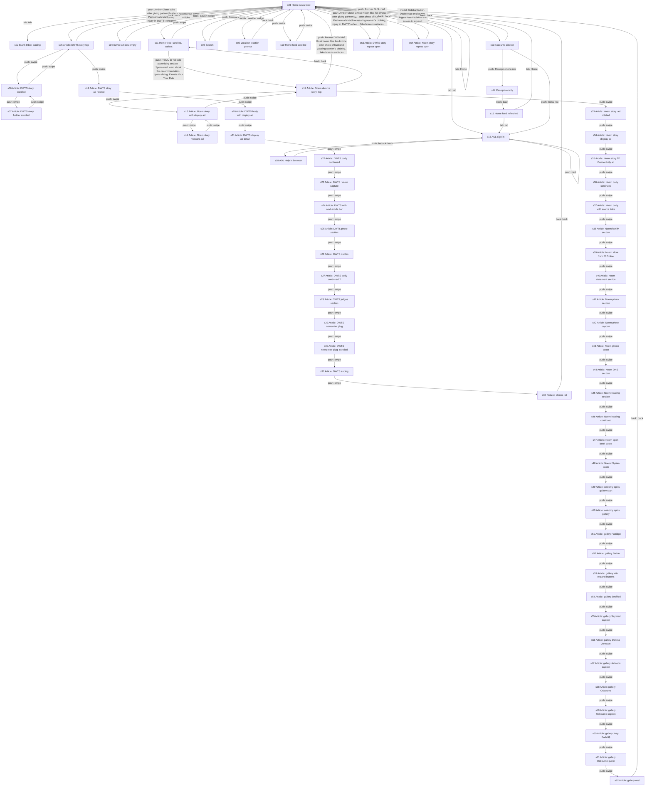
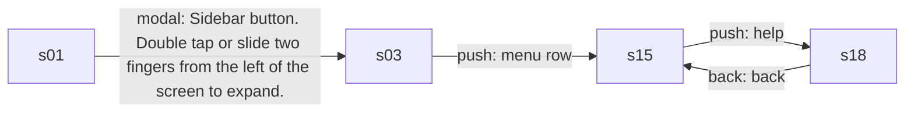
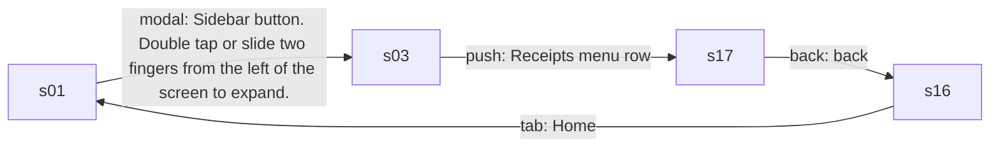
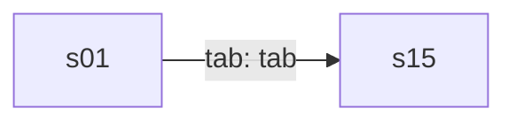
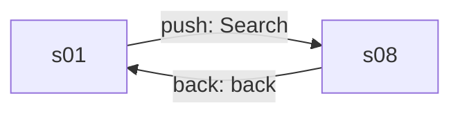

# Product model: AOL 7.81.0

Category **content** · 64 states · 86 edges · 6 core flows · run `20260929-205304-1f19585` · source `explorer_run`

## Navigation graph

## Core flows

### f1 Read the top story to the end

User opens the lead headline, scrolls through the article past in-article ads to related stories, then returns to the feed.

```mermaid
flowchart LR
  s01 -->|push: Amber Glenn sobs after giving partner Pasha Pashkov a brutal bloody injury in 'DWTS' rehearsal| s05
  s05 -->|push: swipe| s19
  s19 -->|push: swipe| s20
  s20 -->|push: swipe| s21
  s21 -->|push: swipe| s22
  s22 -->|push: swipe| s23
  s23 -->|push: swipe| s24
  s24 -->|push: swipe| s25
  s25 -->|push: swipe| s26
  s26 -->|push: swipe| s27
  s27 -->|push: swipe| s28
  s28 -->|push: swipe| s29
  s29 -->|push: swipe| s30
  s30 -->|push: swipe| s31
  s31 -->|push: swipe| s32
  s32 -->|back: back| s01
```

### f2 Read a second story and its gallery

User opens another headline and scrolls a long article that turns into a photo gallery, with display ads along the way.

```mermaid
flowchart LR
  s01 -->|push: Former DHS chief Kristi Noem files for divorce after photo of husband wearing women's clothing, fake breasts surfaces| s12
  s12 -->|push: swipe| s33
  s33 -->|push: swipe| s34
  s34 -->|push: swipe| s35
  s35 -->|push: swipe| s36
  s36 -->|push: swipe| s37
  s37 -->|push: swipe| s38
  s38 -->|push: swipe| s39
  s39 -->|push: swipe| s40
  s40 -->|push: swipe| s41
  s41 -->|push: swipe| s42
  s42 -->|push: swipe| s43
  s43 -->|push: swipe| s44
  s44 -->|push: swipe| s45
  s45 -->|push: swipe| s46
  s46 -->|push: swipe| s47
  s47 -->|push: swipe| s48
  s48 -->|push: swipe| s49
  s49 -->|push: swipe| s50
  s50 -->|push: swipe| s51
  s51 -->|push: swipe| s52
  s52 -->|push: swipe| s53
  s53 -->|push: swipe| s54
  s54 -->|push: swipe| s55
  s55 -->|push: swipe| s56
  s56 -->|push: swipe| s57
  s57 -->|push: swipe| s58
  s58 -->|push: swipe| s59
  s59 -->|push: swipe| s60
  s60 -->|push: swipe| s61
  s61 -->|push: swipe| s62
  s62 -->|back: back| s01
```

### f3 Sign in from the sidebar

User opens the sidebar, taps Manage Accounts and lands on AOL sign-in, where Help opens the web help site.

### f4 Check Receipts

User opens the sidebar, taps Receipts to see inbox-based spending, then returns to the feed.

### f5 Open Inbox tab

Tapping the Inbox tab sends a signed-out user to the AOL sign-in page.

### f6 Search news

User opens search, sees suggested trending searches, and closes it.

## States

| id | kind | name | rating | mock | elements | purpose |
|---|---|---|---|---|---|---|
| s01 | screen | Home news feed | safe | yes | 74 | The user browses Top Stories headlines with category tabs, a weather widget and sponsored ad cards mixed in. Leads to articles, search, saved articles, the sidebar, weather permission and the Inbox tab. |
| s02 | screen | Blank Inbox loading | unknown |  | 0 | An empty white screen shown right after tapping the Inbox tab, before the sign-in page loads. |
| s03 | modal | Accounts sidebar | safe | yes | 136 | A side drawer over the feed with account links: Manage Accounts, Contacts, Receipts, Unsubscribe, Manage Notifications, Settings, feedback and support. Leads to sign-in and Receipts. |
| s04 | screen | Saved articles (empty) | safe |  | 13 | Lists articles the user bookmarked; here it shows an empty state. Back returns to the feed. |
| s05 | screen | Article: DWTS story (top) | safe | yes | 37 | Top of an Entertainment Weekly article with headline, byline, a sponsored ad card and key points, plus a bottom bar for comments, font size and sharing. Swiping scrolls the story. |
| s06 | screen | Article: DWTS story (scrolled) | safe |  | 36 | The same article scrolled past the headline, showing the in-article ad and key points. |
| s07 | screen | Article: DWTS story (further scrolled) | safe |  | 32 | The article scrolled further into the body text with linked names. |
| s08 | screen | Search | safe | yes | 37 | The user types a query or picks a suggested trending search. Close returns to the feed. |
| s09 | modal | Weather location prompt | safe | yes | 14 | A dialog asking the user to allow location for accurate weather forecasts, with Not now and Allow Location buttons. |
| s10 | screen | Home feed (scrolled) | safe | yes | 100 | The feed scrolled down, showing more stories and an ad slot labeled AD. |
| s11 | screen | Home feed (scrolled, variant) | safe |  | 100 | Another scrolled capture of the feed; tapping a story opens the Kristi Noem article. |
| s12 | screen | Article: Noem divorce story (top) | safe | yes | 43 | Top of an E! article with headline, byline, a sponsored Temu card and body text. Swiping scrolls the story. |
| s13 | screen | Article: Noem story with display ad | safe | yes | 40 | The article scrolled to where a display ADVERTISEMENT block begins below the body text. |
| s14 | screen | Article: Noem story mascara ad | safe | yes | 34 | The article scrolled to a full display ad for mascara with rating stars. |
| s15 | screen | AOL sign-in | safe | yes | 7 | Sign in to AOL with email or phone, with links to forgot username, create account, help, terms and privacy. Reached from the Inbox tab and Manage Accounts. |
| s16 | screen | Home feed (refreshed) | safe | yes | 74 | The home feed after returning from Receipts, with a different sponsored card (shower filters). |
| s17 | screen | Receipts (empty) | safe | yes | 11 | Shows spending activity pulled from the user's inbox; here it is empty. Back returns to the feed. |
| s18 | external | AOL Help in browser | safe |  | 18 | External browser page help.aol.com opened from the sign-in Help link. Back returns to sign-in. |
| s19 | screen | Article: DWTS story (ad rotated) | safe | yes | 36 | The DWTS article scrolled, with a different sponsored card (Extend-A-Reach). |
| s20 | screen | Article: DWTS body with display ad | safe | yes | 30 | Article body followed by an ADVERTISEMENT block for gutter covers. |
| s21 | screen | Article: DWTS display ad detail | safe | yes | 33 | The article scrolled to show the full Homebuddy display ad. |
| s22 | screen | Article: DWTS body continued | safe | yes | 31 | More article body text around the display ad. |
| s23 | screen | Article: DWTS (vision capture) | safe | yes | 6 | An article scroll position captured only by vision, with links and a next-article arrow. |
| s24 | screen | Article: DWTS with next-article bar | safe | yes | 26 | Article body with a pinned 'Next in More For You' bar that leads to the next story. |
| s25 | screen | Article: DWTS photo section | safe | yes | 24 | Article body with an inline photo and caption, ad above. |
| s26 | screen | Article: DWTS quotes | safe | yes | 21 | Article body with quotes, Homebuddy ad footer above. |
| s27 | screen | Article: DWTS body continued 2 | safe | yes | 17 | More body text of the DWTS article with the next-article bar. |
| s28 | screen | Article: DWTS judges section | safe | yes | 14 | Body text about the show night and judges. |
| s29 | screen | Article: DWTS newsletter plug | safe | yes | 20 | Body text with a link to the EW Dispatch newsletter. |
| s30 | screen | Article: DWTS newsletter plug (scrolled) | safe | yes | 21 | Same newsletter link region scrolled further. |
| s31 | screen | Article: DWTS ending | safe | yes | 20 | End of the DWTS article body. |
| s32 | screen | Related stories list | safe | yes | 46 | Related DWTS stories from other publishers with a sponsored card between them. Back returns to the feed. |
| s33 | screen | Article: Noem story (ad rotated) | safe | yes | 39 | The Noem article with a rotated sponsored card (Yahoo Search) and a display ad starting below. |
| s34 | screen | Article: Noem story display ad | safe | yes | 30 | The Noem article scrolled to the data-centers display ad. |
| s35 | screen | Article: Noem story TE Connectivity ad | safe | yes | 28 | Body text with a display ad for TE Connectivity with an Open button. |
| s36 | screen | Article: Noem body continued | safe | yes | 30 | More body text around the TE Connectivity ad. |
| s37 | screen | Article: Noem body with source links | safe | yes | 32 | Body text with links to the Daily Mail. |
| s38 | screen | Article: Noem family section | safe | yes | 37 | Body text with a 'More from E! Online' link list starting. |
| s39 | screen | Article: Noem More from E! Online | safe | yes | 39 | Body text with three related E! Online story links. |
| s40 | screen | Article: Noem statement section | safe | yes | 44 | Body text with quotes from the family rep and related links. |
| s41 | screen | Article: Noem photo section | safe | yes | 35 | Body text followed by a photo of the couple. |
| s42 | screen | Article: Noem photo caption | safe | yes | 29 | The couple photo with its credit caption. |
| s43 | screen | Article: Noem phone quote | safe | yes | 27 | Body text with the husband's phone quote. |
| s44 | screen | Article: Noem DHS section | safe | yes | 27 | Body text about her firing from DHS. |
| s45 | screen | Article: Noem hearing section | safe | yes | 22 | Body text about a House hearing with a news photo. |
| s46 | screen | Article: Noem hearing continued | safe | yes | 18 | Continued body text and hearing photo. |
| s47 | screen | Article: Noem open book quote | safe | yes | 19 | Body text with photo credit and quotes. |
| s48 | screen | Article: Noem Elysian quote | safe | yes | 22 | Body text quoting an interview. |
| s49 | screen | Article: celebrity splits gallery start | safe | yes | 16 | The article turns into a gallery of celebrity breakups. |
| s50 | screen | Article: celebrity splits gallery | safe | yes | 13 | Gallery intro scrolled. |
| s51 | screen | Article: gallery Patridge | safe | yes | 13 | Gallery entry on Audrina Patridge and Michael Ray. |
| s52 | screen | Article: gallery Balvin | safe | yes | 15 | Gallery entries with photos. |
| s53 | screen | Article: gallery with expand buttons | safe | yes | 10 | Gallery entries with truncated captions and expand buttons. |
| s54 | screen | Article: gallery Seyfried | safe | yes | 10 | Gallery entries continued. |
| s55 | screen | Article: gallery Seyfried caption | safe | yes | 9 | Gallery entry caption for Amanda Seyfried. |
| s56 | screen | Article: gallery Dakota Johnson | safe | yes | 12 | Gallery entries continued. |
| s57 | screen | Article: gallery Johnson caption | safe | yes | 9 | Gallery entry for Dakota Johnson. |
| s58 | screen | Article: gallery Osbourne | safe | yes | 12 | Gallery entries continued. |
| s59 | screen | Article: gallery Osbourne caption | safe | yes | 8 | Gallery entry for Kelly Osbourne. |
| s60 | screen | Article: gallery Joey Bada$$ | safe | yes | 11 | Gallery entries continued. |
| s61 | screen | Article: gallery Osbourne quote | safe | yes | 11 | Gallery entry with quote. |
| s62 | screen | Article: gallery end | safe | yes | 10 | Last captured gallery entries; back returns to the feed. |
| s63 | screen | Article: DWTS story (repeat open) | safe |  | 25 | The DWTS article opened again during the core-loop passes, without the sponsored card loaded. Back returns to the feed. |
| s64 | screen | Article: Noem story (repeat open) | safe | yes | 26 | The Noem article opened again during the core-loop passes. Back returns to the feed. |

## Mechanics

- **ad** (observed) Taboola sponsored cards labeled 'Ad' sit between stories in the home feed and related list; the advertiser rotates between visits (TEMU, Toxin Free Life, Extend-A-Reach). · evidence s01.e44, s01.e49, s16.e44, s10.e33, s32.e19
- **ad** (observed) Each article carries a sponsored Taboola card under the byline and one or more ADVERTISEMENT display blocks inside the body (captures show 'Test Ad' badges). · evidence s05.e13, s05.e15, s19.e10, s33.e10, s13.e34, s20.e27, s35.e18, s14.e33 · numbers $2.36
- **entitlement** (observed) News is free without an account; the Inbox tab and Manage Accounts require signing in to AOL. · evidence s01.e71, s01.e71>s15, s15.e01, s15.e03, s03.e113
- **paywall** (unknown) Code flagged a paywall on pass 3 of the repeated article opens, but no upgrade screen, price or benefit text appears in the captured article screen. · evidence s64.e04, s01.e59>s64, s64.back>s01
- **other** (observed) Receipts screen lists spending activity parsed from the user's email inbox; empty for a signed-out user. · evidence s03.e117, s17.e03, s17.e04
- **other** (observed) Tapping the weather widget asks for location permission to show local forecasts. · evidence s09.e03, s09.e05, s09.e06

## Value ledger

- actor: "TEMU in Taboola advertising section" · s01.e45
- actor: "New Temu users get jackets for $2.36" · s05.e15
- actor: "Toxin Free Life" · s16.e46
- actor: "Extend-A-Reach" · s19.e14
- actor: "Homebuddy.com" · s21.e30
- actor: "TE Connectivity" · s35.e22
- actor: "Sponsored: learn about this recommendation (opens dialog)" · s01.e48
- meter: "There isn't any spending activity yet" · s17.e03
- experience: "Core action over 3 passes (explore steps 130-134): load started median 2.2 s (min 2.1, max 3.3, n=3); finished median 2.2 s (min 2.1, max 3.3, n=3); chars median 630 (min 471, max 823, n=3)" · s01.e36>s05, s01.e36>s63, s01.e59>s64, s63.back>s01, s64.back>s01
- experience: "paywall appeared on pass 3 of the core action (explore steps 130-134)" · s01.e36>s05, s01.e36>s63, s01.e59>s64, s63.back>s01, s64.back>s01

## App terms

- **Taboola**: meaning not observed · used in m1, m2, l1
- **Receipts**: meaning not observed · used in m5, l8
- **Sponsored** (everyday word, never flagged): meaning not observed · used in l7, m1
- **Inbox** (everyday word, never flagged): meaning not observed · used in m3

## Values shared across screens

- Temu sponsored card headline: New Temu users get jackets for $2.36 · s05.e15, s06.e12, s12.e15, s13.e12
- Feed ad card headline: Elevate Your Your Ride · s01.e51, s10.e79, s11.e79

## Open questions (for a targeted explore pass)

- q1 What paywall did code detect on pass 3 of the article loop, and what does it offer or cost? · start at s01, look for: An upgrade or subscribe screen with prices after opening several articles in a row.
- q2 Does the app offer a paid ad-free or premium plan anywhere? · start at s03, look for: A subscription or ad-free option with a price inside Settings or Manage Accounts.
- q3 What does a signed-in user see in the Inbox tab and are there mail storage or feature limits? · start at s15, look for: The Inbox screen after signing in, with any storage meter or upgrade prompt.
- q4 What does the Unsubscribe menu item do and is any part of it paid? · start at s03, look for: The screen opened by tapping Unsubscribe in the sidebar.
- q5 What appears when the user taps the 'Sponsored: learn about this recommendation' info on an ad card? · start at s01, look for: The dialog explaining the ad and any option to hide ads.
