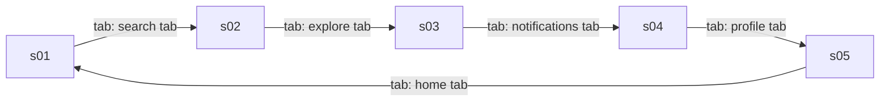
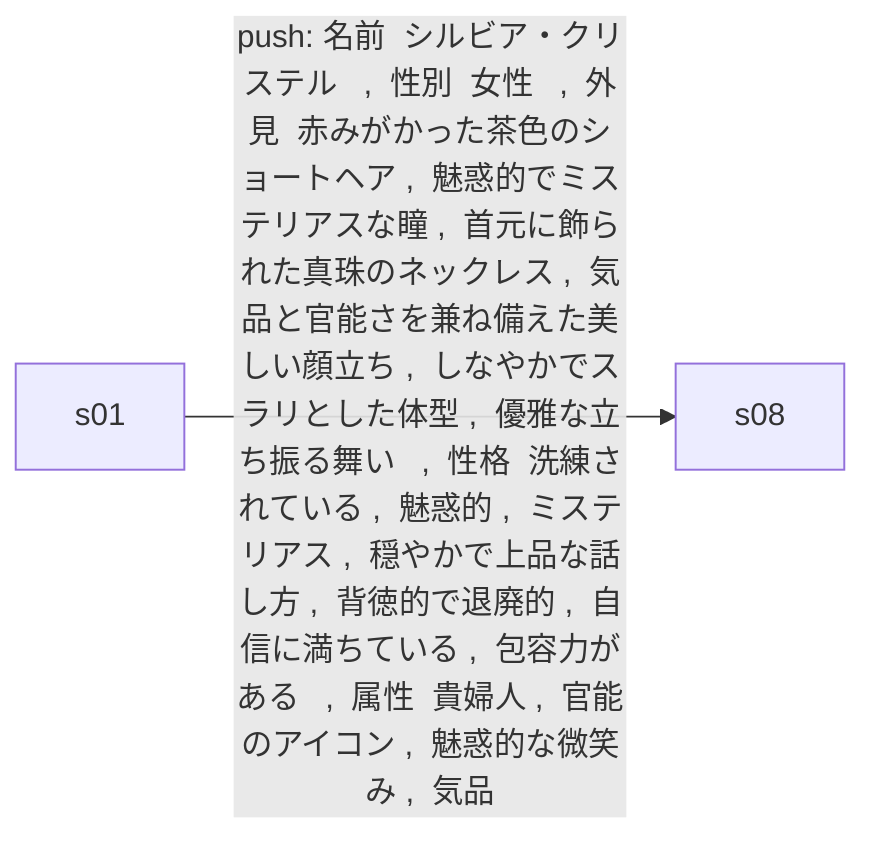
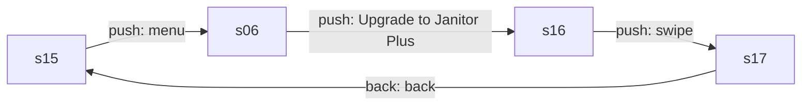
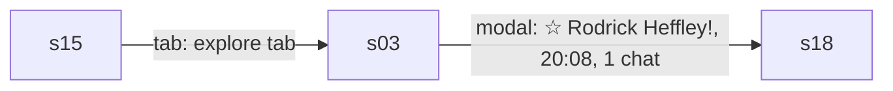
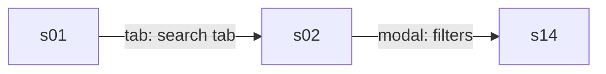
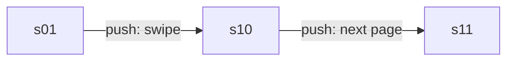

# Product model: Janitor AI 2.5.0

Category **chat** · 20 states · 30 edges · 6 core flows · run `20260929-203310-1f19585` · source `explorer_run`

## Navigation graph

```mermaid
flowchart TD
  s01["s01 Home character feed"]
  s02["s02 Search"]
  s03["s03 My Chats"]
  s04["s04 Notifications"]
  s05["s05 My profile"]
  s06["s06 Side menu drawer"]
  s07["s07 Creator profile"]
  s08["s08 Character detail"]
  s09["s09 Home feed scrolled"]
  s10["s10 Home feed scrolled  page 1"]
  s11["s11 Home feed page 2"]
  s12["s12 Android home screen"]
  s13["s13 Home character feed  refreshed"]
  s14["s14 Search filter sheet"]
  s15["s15 Home character feed  alternate"]
  s16["s16 Janitor Plus paywall"]
  s17["s17 Janitor Plus paywall  scrolled"]
  s18["s18 Chat history sheet  1 chat"]
  s19["s19 Chat history sheet  15 chats"]
  s20["s20 Chat history sheet  3 chats"]
  s01 -->|tab: search tab| s02
  s02 -->|tab: explore tab| s03
  s03 -->|tab: notifications tab| s04
  s04 -->|tab: profile tab| s05
  s05 -->|tab: home tab| s01
  s01 -->|push: menu| s06
  s06 -->|back: back| s01
  s01 -->|push: @Mini890| s07
  s07 -->|back: back| s01
  s01 -->|push: 名前  シルビア・クリステル   ,  性別  女性   ,  外見  赤みがかった茶色のショートヘア ,  魅惑的でミステリアスな瞳 ,  首元に飾られた真珠のネックレス ,  気品と官能さを兼ね備えた美しい顔立ち ,  しなやかでスラリとした体型 ,  優雅な立ち振る舞い   ,  性格  洗練されている ,  魅惑的 ,  ミステリアス ,  穏やかで上品な話し方 ,  背徳的で退廃的 ,  自信に満ちている ,  包容力がある   ,  属性  貴婦人 ,  官能のアイコン ,  魅惑的な微笑み ,  気品| s08
  s08 -->|back: back| s01
  s01 -->|push: swipe| s09
  s09 -->|push: swipe| s01
  s01 -->|push: swipe| s10
  s10 -->|push: next page| s11
  s11 -->|back: back| s12
  s13 -->|tab: search tab| s02
  s02 -->|modal: filters| s14
  s13 -->|push: menu| s06
  s15 -->|push: menu| s06
  s06 -->|push: Upgrade to Janitor Plus| s16
  s16 -->|push: swipe| s17
  s17 -->|back: back| s15
  s15 -->|tab: explore tab| s03
  s03 -->|modal: ☆ Rodrick Heffley!, 20:08, 1 chat| s18
  s18 -->|back: back| s03
  s03 -->|modal: Kang Jun-Seo  Idol x Idol , 02:12, 15 chats| s19
  s19 -->|back: back| s03
  s03 -->|modal: The Former Husband is the New Employer , 02:00, 3 chats| s20
  s20 -->|back: back| s03
```

## Core flows

### f1 Bottom tab tour

Move between Home, Search, My Chats, Notifications and Profile via the tab bar.

### f2 Open a character

From the home feed, open a character's detail page where the user can start a chat.

### f3 Upgrade to Janitor Plus

Open the drawer, tap the upgrade banner, view the $12.99/month paywall and dismiss it.

### f4 Resume a chat

Go to My Chats and open a character's saved chat sessions to continue or start a new one (the measured core action).

### f5 Filter search results

Open Search and the filter sheet to sort and filter characters by messages, tokens and proxy.

### f6 Page through the feed

Scroll the home grid and advance to the next page of characters.

## States

| id | kind | name | rating | mock | elements | purpose |
|---|---|---|---|---|---|---|
| s01 | screen | Home character feed | mixed | yes | 68 | Browse a paged grid of community-made AI characters, filtered by All/Limited and Following/Favorites/Trending/Hidden Gems. Tapping a card opens its detail page, a creator handle opens their profile, and the menu opens the side drawer. |
| s02 | screen | Search | safe | yes | 35 | Search characters by name and narrow them with tag chips and toggles. The filters button opens the filter sheet. |
| s03 | screen | My Chats | safe | yes | 27 | Lists every character the user has chatted with, with last-message time and number of chat sessions. Tapping a row opens that character's chat history sheet. |
| s04 | screen | Notifications | safe | yes | 11 | Shows the user's notifications; empty here. Leads to other tabs. |
| s05 | screen | My profile | safe | yes | 28 | Shows the user's handle, follow counts and tabs for their Characters, Personas and Scripts, with a button to create a new character. |
| s06 | screen | Side menu drawer | safe | yes | 53 | Account drawer with profile summary, navigation links (Following, Blocks, Media Library, Settings, Billing) and an Upgrade to Janitor Plus banner that opens the paywall. |
| s07 | screen | Creator profile | safe | yes | 10 | Public profile of a character creator with follow, options and share buttons and a list of their characters. Back returns to the feed. |
| s08 | screen | Character detail | mixed | yes | 43 | Shows one character's art, creator, dates, tags, proxy rule and token size, with a persona picker and a Chat with button to start chatting. Comments sit below. |
| s09 | screen | Home feed scrolled | mixed |  | 68 | The home feed scrolled down to show more character cards with tags and token sizes. Swiping returns to the top. |
| s10 | screen | Home feed scrolled (page 1) | mixed | yes | 70 | Scrolled home feed on page 1; the next-page button loads page 2. |
| s11 | screen | Home feed page 2 | mixed | yes | 86 | Second page of the character grid, with cards tagged by genre and content (including Smut and Dead Dove). Back left the app. |
| s12 | external | Android home screen | safe |  | 22 | The device launcher shown after backing out of the app; outside the app. |
| s13 | screen | Home character feed (refreshed) | mixed |  | 66 | Home feed with a different card order. Leads to Search via the tab bar or the drawer via the menu. |
| s14 | sheet | Search filter sheet | safe | yes | 118 | Bottom sheet to sort results (Popular, Latest, Trending, Trending 24h, Relevance) and filter by message count, token count and proxy support. |
| s15 | screen | Home character feed (alternate) | mixed | yes | 75 | Home feed showing another set of Hidden Gems cards. Menu opens the drawer; the center tab opens My Chats. |
| s16 | screen | Janitor Plus paywall | safe | yes | 23 | Subscription offer for Janitor Plus at $12.99/month listing its benefits, with Subscribe now, More info, legal links and a close button. |
| s17 | screen | Janitor Plus paywall (scrolled) | safe | yes | 23 | Same paywall slightly scrolled; back returns to the home feed. |
| s18 | sheet | Chat history sheet (1 chat) | safe | yes | 44 | Sheet listing the saved chat sessions with one character, sortable Oldest/Latest, with a Start new chat button. |
| s19 | sheet | Chat history sheet (15 chats) | safe |  | 89 | Sheet listing 15 saved chat sessions with one character, each with a preview and message count, plus Start new chat. |
| s20 | sheet | Chat history sheet (3 chats) | safe |  | 54 | Sheet listing 3 saved chat sessions with one character and a Start new chat button. |

## Mechanics

- **paywall** (observed) Janitor Plus subscription sold from an upgrade banner in the side drawer; single monthly price shown, billed through Google Play, auto-renews. · evidence s06.e44, s16.e03, s16.e04, s16.e05, s16.e07, s06.e44>s16 · numbers $12.99, /month
- **entitlement** (observed) Plus adds to the Free tier: 5x chat context (memory), priority routing for faster replies, monthly swipes on frontier models, and a golden checkmark by the username. · evidence s16.e08, s16.e09, s16.e10, s16.e11, s16.e12 · numbers 5×
- **limit** (inferred) Paywall copy implies swipes on frontier models are capped per month, and that free chats keep less context. No limit appeared in the 1 measured pass of opening a chat history. · evidence s16.e11, s16.e02
- **other** (observed) Creators can disallow Proxy use for a character, and search can filter by proxy support; suggests an option to chat through a user-supplied model backend. · evidence s08.e30, s14.e114, s14.e115
- **other** (observed) User-generated catalog: users create and publish characters, follow creators, and the Hidden Gems feed promotes smaller creators. · evidence s05.e17, s01.e15, s07.e05

## Value ledger

- price: "$12.99" · s16.e03
- price: "/month" · s16.e04
- paywall_bullet: "Everything in Free, plus:" · s16.e08
- paywall_bullet: "5× context for better memory" · s16.e09
- paywall_bullet: "Priority routing for faster replies" · s16.e10
- paywall_bullet: "Generous monthly swipes with our frontier models" · s16.e11
- paywall_bullet: "Golden checkmark next to your username" · s16.e12
- paywall_bullet: "Keep more of the story in context, get faster replies, and unlock smarter swipes." · s16.e02
- meter: "15 chats" · s03.e12
- actor: "Hidden Gems show characters from smaller creators with engaging conversations, created in the last 30 days." · s01.e15
- experience: "Core action over 1 pass (explore steps 87-87): load started 0.9 s (1 measurement); finished 0.9 s (1 measurement); chars 586 (1 measurement)" · s03.e05>s18
- experience: "sheet opened appeared on pass 1 of the core action (explore steps 87-87)" · s03.e05>s18

## App terms

- **Janitor Plus**: The app's paid monthly subscription tier. · defined by s16.e08, s16.e09, s16.e10, s16.e11, s16.e12 · through tap s06.e44>s16 · used in m1, m2
- **Free** (everyday word, never flagged): meaning not observed · used in m2, l3
- **context**: How much of the conversation the AI remembers when replying. · defined by s16.e02, s16.e09 · used in m2, m3, l4, l8
- **Priority routing**: Paid users' requests are served first so AI replies arrive faster. · defined by s16.e10 · used in m2, l5
- **swipes**: meaning not observed · used in m2, m3, l6, l8
- **frontier models**: meaning not observed · used in m2, l6
- **Golden checkmark** (everyday word, never flagged): A gold badge shown next to a subscriber's username. · defined by s16.e12 · used in m2, l7
- **Proxy**: meaning not observed · used in m4
- **Hidden Gems**: A feed of recent characters from smaller creators with engaging conversations. · defined by s01.e15 · used in m5, l10

## Values shared across screens

- Janitor Plus monthly price: $12.99 · s16.e03, s17.e03
- Feed page counter: 1 / 295 · s01.e30, s09.e18, s10.e18, s13.e30, s15.e30, s14.e41, s06.e08
- Chat sessions with Kang Jun-Seo: 15 chats · s03.e12, s18.e27, s19.e04, s19.e72, s20.e37
- User following count: 0 · s05.e04, s06.e25

## Open questions (for a targeted explore pass)

- q1 What limit does a free user hit when chatting, and what does the limit screen offer? · start at s18, look for: A cap banner or upsell after sending many messages or swipes in a chat started from Start new chat.
- q2 Are there other plans or an annual price beyond $12.99/month? · start at s16, look for: Additional plans or pricing inside the expanded More info section.
- q3 How many swipes does Free get versus Janitor Plus per month? · start at s16, look for: A number of monthly swipes in More info or in a usage meter inside a chat.
- q4 What does the Billing page show for a free account? · start at s06, look for: Current plan, usage, or purchase options after tapping Billing in the drawer.
- q5 What does Proxy mean and is it tied to the paid tier? · start at s14, look for: An explanation or settings screen after toggling Proxy or visiting Settings from the drawer.
