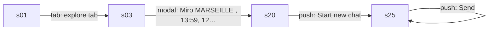
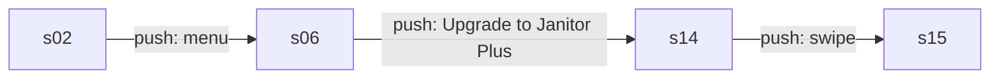
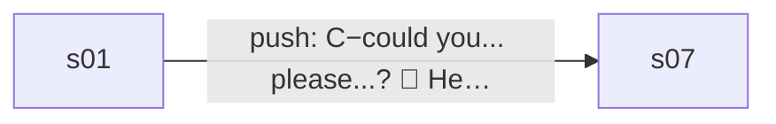
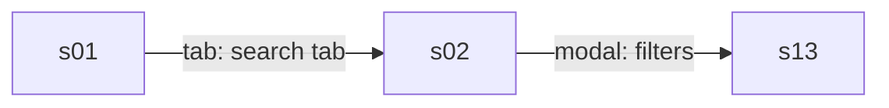
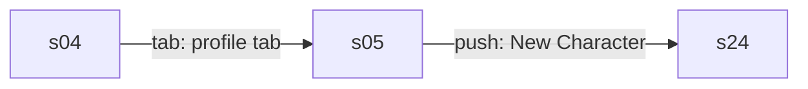
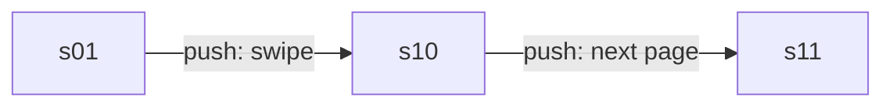

# Product model: Janitor AI 2.5.0

Category **chat** · 25 states · 56 edges · 6 core flows · run `20261002-223246-4b439a0` · source `explorer_run`

## Navigation graph

```mermaid
flowchart TD
  s01["s01 Home feed  Hidden Gems"]
  s02["s02 Search"]
  s03["s03 My Chats"]
  s04["s04 Notifications"]
  s05["s05 Profile"]
  s06["s06 Side menu drawer"]
  s07["s07 Character detail  Kitsunami"]
  s08["s08 Character detail  Parkour Reborn RPG"]
  s09["s09 Search with tag filter"]
  s10["s10 Home feed scrolled"]
  s11["s11 Home feed page 2"]
  s12["s12 Device home screen"]
  s13["s13 Search filters sheet"]
  s14["s14 Janitor Plus paywall"]
  s15["s15 Janitor Plus paywall  scrolled"]
  s16["s16 Search results scrolled"]
  s17["s17 Settings"]
  s18["s18 Character chat list  Kang Jun-Seo"]
  s19["s19 Character chat list  Rodrick Heffley"]
  s20["s20 Character chat list  Miro"]
  s21["s21 Character chat list  Nanami Kento"]
  s22["s22 Notification settings"]
  s23["s23 Media Library"]
  s24["s24 Create a Character"]
  s25["s25 Chat conversation"]
  s01 -->|tab: search tab| s02
  s02 -->|tab: explore tab| s03
  s03 -->|tab: notifications tab| s04
  s04 -->|tab: profile tab| s05
  s05 -->|tab: home tab| s01
  s01 -->|push: menu| s06
  s06 -->|back: back| s01
  s01 -->|push: C−could you... please...? 🌊 He…| s07
  s07 -->|back: back| s01
  s01 -->|push: 🏙️Fragment Update! , An average…| s08
  s08 -->|back: back| s01
  s01 -->|push: Parkour Reborn RPG| s08
  s01 -->|push: 👨 Male| s09
  s09 -->|tab: home tab| s01
  s01 -->|push: swipe| s10
  s10 -->|push: swipe| s01
  s10 -->|push: next page| s11
  s11 -->|back: back| s12
  s02 -->|modal: filters| s13
  s13 -->|back: back| s02
  s02 -->|push: menu| s06
  s06 -->|push: Upgrade to Janitor Plus| s14
  s14 -->|push: swipe| s15
  s15 -->|push: swipe| s14
  s14 -->|back: back| s02
  s02 -->|push: swipe| s16
  s16 -->|push: swipe| s02
  s03 -->|push: menu| s06
  s06 -->|push: Settings| s17
  s17 -->|back: back| s03
  s06 -->|back: back| s03
  s03 -->|tab: home tab| s01
  s01 -->|tab: explore tab| s03
  s03 -->|modal: Kang Jun-Seo Idol x Idol…| s18
  s18 -->|back: back| s03
  s03 -->|modal: ☆ Rodrick Heffley!, Tue, 1…| s19
  s19 -->|back: back| s03
  s03 -->|modal: Miro MARSEILLE , 13:59, 12…| s20
  s20 -->|back: back| s03
  s03 -->|modal: NANAMI KENTO, Tue, 4 chats| s21
  s21 -->|back: back| s03
  s04 -->|push: settings| s22
  s22 -->|back: back| s04
  s04 -->|push: menu| s06
  s06 -->|push: Media Library| s23
  s23 -->|back: back| s04
  s06 -->|back: back| s04
  s04 -->|tab: home tab| s01
  s01 -->|tab: notifications tab| s04
  s05 -->|push: New Character| s24
  s24 -->|back: back| s05
  s05 -->|tab: chats tab| s03
  s20 -->|push: Start new chat| s25
  s25 -->|push: message input| s25
  s25 -->|push: type| s25
  s25 -->|push: Send| s25
```

## Core flows

### f1 Resume a roleplay chat

Open My Chats, pick a character's chat list, start a chat and send messages to get long AI replies.

### f2 Upgrade to Janitor Plus

From the side menu, the upgrade banner opens the $12.99/month subscription paywall.

### f3 Discover a character

Tap a character card in the home feed to see its details and the Chat button.

### f4 Search and filter characters

Go to Search and open the filter sheet to sort and filter by messages, tokens and proxy.

### f5 Create a character

From the profile, New Character opens the character creation form.

### f6 Page through Hidden Gems

Scroll the home feed and move to the next page of characters.

## States

| id | kind | name | rating | mock | elements | purpose |
|---|---|---|---|---|---|---|
| s01 | screen | Home feed (Hidden Gems) | mixed | yes | 85 | Browse character cards filtered by All/Limited and Following/Favorites/Trending/Hidden Gems, page through results, and open a character. The bottom tabs lead to search, chats, notifications and profile, and the menu opens the side drawer. |
| s02 | screen | Search | mixed | yes | 94 | Search characters by text and tag chips, filter by visibility and source, and page through 10,000 results. The filters button opens the filter sheet. |
| s03 | screen | My Chats | mixed | yes | 31 | Lists the characters the user has chatted with and how many chats each has. Tapping a row opens that character's chat list sheet. |
| s04 | screen | Notifications | safe | yes | 11 | Shows the user's notifications (empty here). The gear opens notification settings. |
| s05 | screen | Profile | safe | yes | 28 | The user's own profile with follower counts and tabs for Characters, Personas and Scripts. New Character starts character creation. |
| s06 | screen | Side menu drawer | safe | yes | 60 | Account drawer with links to Following, Blocks, Media Library, Settings, Billing and an Upgrade to Janitor Plus banner that opens the paywall. |
| s07 | screen | Character detail (Kitsunami) | mixed | yes | 51 | Shows a character's image, creator, stats, dates, tags, proxy status and the persona the user plays as. Chat with Kitsunami starts a chat. |
| s08 | screen | Character detail (Parkour Reborn RPG) | safe | yes | 52 | Character page with description, dates, tags and proxy status. Back returns to the feed. |
| s09 | screen | Search with tag filter | mixed |  | 96 | Search results narrowed by a selected tag chip, showing popular characters. Tabs lead elsewhere. |
| s10 | screen | Home feed scrolled | mixed | yes | 89 | Hidden Gems feed scrolled to show token counts and more cards. Next page moves to page 2. |
| s11 | screen | Home feed page 2 | mixed | yes | 70 | Second page of Hidden Gems characters. Back leaves the app. |
| s12 | external | Device home screen | safe |  | 17 | The phone launcher shown after backing out of the app. |
| s13 | sheet | Search filters sheet | safe | yes | 118 | Sort results (Popular, Latest, Trending, Trending 24h, Relevance) and filter by message count, token count and proxy. Back closes it. |
| s14 | screen | Janitor Plus paywall | safe | yes | 28 | Subscription offer at $12.99/month listing memory, speed, swipes and badge benefits. Subscribe now buys; close or back exits. |
| s15 | screen | Janitor Plus paywall (scrolled) | safe | yes | 28 | Same subscription offer slightly scrolled. Swiping returns to the top. |
| s16 | screen | Search results scrolled | mixed |  | 86 | Search results scrolled past the filter chips showing token counts and more cards. |
| s17 | screen | Settings | safe |  | 20 | Account and app settings: profile, sign-in, creator verification, theme, preferences, language. |
| s18 | sheet | Character chat list (Kang Jun-Seo) | safe |  | 96 | Lists the user's separate chats with one character, sortable oldest/latest. Start new chat opens a fresh chat. |
| s19 | sheet | Character chat list (Rodrick Heffley) | safe |  | 51 | Lists the single chat with this character. Start new chat or open the existing one. |
| s20 | sheet | Character chat list (Miro) | mixed | yes | 96 | Lists the user's 12 chats with Miro with previews and message counts. Start new chat opens the chat screen. |
| s21 | sheet | Character chat list (Nanami Kento) | safe |  | 67 | Lists the user's 4 chats with this character. Start new chat opens a fresh chat. |
| s22 | screen | Notification settings | safe |  | 32 | Toggles for comment, reply, pin, new character, update, poll, follower and favorite notifications. |
| s23 | screen | Media Library | safe |  | 11 | The user's uploaded files with search, new folder and upload actions (empty here). |
| s24 | screen | Create a Character | safe | yes | 19 | Form to upload a character image and enter name, chat name and bio to publish a new character. |
| s25 | screen | Chat conversation | unsafe | yes | 21 | Roleplay chat with a character: the AI writes long story replies and the user types messages, picks a persona or asks AI to write for them. |

## Mechanics

- **paywall** (observed) Janitor Plus subscription paywall reached from the side-menu upgrade banner, priced monthly with a Subscribe now button and Google Play billing. · evidence s06.e50, s14.e03, s14.e04, s14.e05, s14.e24, s06.e50>s14 · numbers $12.99, /month
- **entitlement** (observed) Plus adds 5× context memory, priority routing for faster replies, monthly swipes on frontier models, and a golden checkmark next to the username, on top of the Free plan. · evidence s14.e08, s14.e09, s14.e10, s14.e11, s14.e12, s14.e25 · numbers 5×
- **limit** (inferred) Plus offers 'generous monthly swipes', implying swipes are metered per month; no limit, paywall or ad appeared in 6 passes of sending chat messages. · evidence s14.e11, s25.e19>s25
- **other** (observed) Creators mark characters as proxy allowed or not, and search can filter by proxy; lets users chat through an outside AI provider. · evidence s07.e44, s08.e50, s13.e115
- **other** (observed) User-generated characters: anyone can create and publish characters; Hidden Gems promotes characters from smaller creators. · evidence s05.e17, s24.e02, s01.e15 · numbers 30

## Value ledger

- price: "$12.99" · s14.e03
- price: "/month" · s14.e04
- paywall_bullet: "5× context for better memory" · s14.e09
- paywall_bullet: "Priority routing for faster replies" · s14.e10
- paywall_bullet: "Generous monthly swipes with our frontier models" · s14.e11
- paywall_bullet: "Golden checkmark next to your username" · s14.e12
- paywall_bullet: "Everything in Free, plus:" · s14.e08
- meter: "12 chats" · s03.e08
- actor: "Hidden Gems show characters from smaller creators with engaging conversations, created in the last 30 days." · s01.e15
- actor: "All replies are a work of fiction, generated by AI." · s25.e07
- actor: "Get notified when a new comment is submitted to your characters." · s22.e04
- experience: "Core action over 6 passes (explore steps 142-159): reply started median 2.3 s (min 2.2, max 2.5, n=6); finished median 92.15 s (min 78.3, max 96.4, n=6); chars median 3181 (min 2800, max 3520, n=6)" · s25.e15>s25, s25.e19>s25, s25.type>s25
- experience: "After 6 passes of the core action nothing limited it: no limit, paywall, or ad appeared, on an account whose plan (free or paid) was not recorded (explore steps 142-159)" · s25.e15>s25, s25.e19>s25, s25.type>s25

## App terms

- **Janitor Plus**: The paid monthly subscription plan. · defined by s14.e02, s14.e09, s14.e10, s14.e11, s14.e12 · through tap s06.e50>s14 · used in m1, m2
- **Free** (everyday word, never flagged): meaning not observed · used in l7, m2
- **context**: How much of the conversation history the AI remembers when replying. · defined by s14.e01, s14.e02 · used in l3, m2
- **Priority routing**: Paid requests are served first so replies come faster. · defined by s14.e10 · used in l4, m2
- **swipes**: meaning not observed · used in l5, m3
- **frontier models**: meaning not observed · used in l5, m3
- **Golden checkmark** (everyday word, never flagged): A gold badge shown next to a Plus subscriber's username. · defined by s14.e12 · used in l6, m2
- **Proxy**: meaning not observed · used in m4
- **Hidden Gems**: A feed of characters from smaller creators with engaging conversations, made in the last 30 days. · defined by s01.e15 · used in l9, m5

## Values shared across screens

- Janitor Plus monthly price: $12.99 · s14.e03, s15.e03
- Chats with Miro: 12 chats · s03.e08, s18.e68, s19.e23, s20.e04, s20.e68, s21.e38
- Chats with Kang Jun-Seo: 15 chats · s03.e16, s18.e04, s19.e31, s21.e46
- Active persona: Aaditya · s07.e47, s25.e18
- User following count: 0 · s05.e04, s06.e31

## Open questions (for a targeted explore pass)

- q1 Are there other Janitor Plus prices, such as a yearly plan or a trial, behind More info? · start at s14, look for: The expanded More info section or any plan picker on the paywall.
- q2 How many swipes does Free get and how many does Plus get per month? · start at s25, look for: A swipe counter, regenerate control, or limit message after swiping on replies repeatedly.
- q3 Does a free account hit a message or context limit in long chats? · start at s25, look for: A limit banner or upgrade prompt after many more messages in one chat.
- q4 What does the Billing screen show about the current plan? · start at s06, look for: The plan name, renewal date or upgrade options after tapping Billing.
- q5 What does Proxy allowed mean for the user and does it involve payment? · start at s07, look for: An explanation or settings screen after tapping the Proxy allowed row or the chat model selector.
