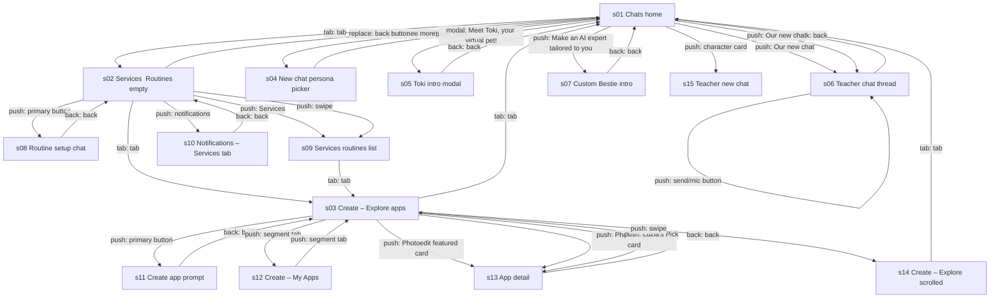
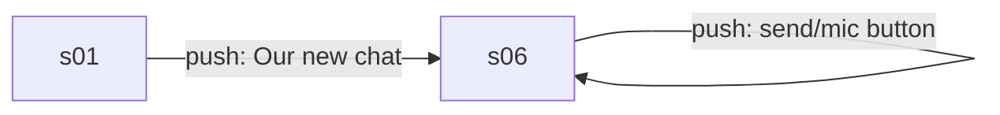
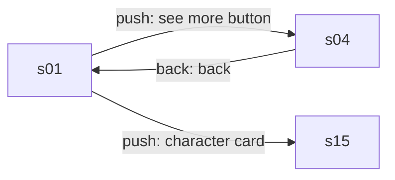
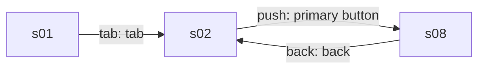
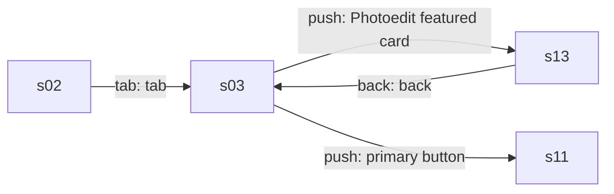
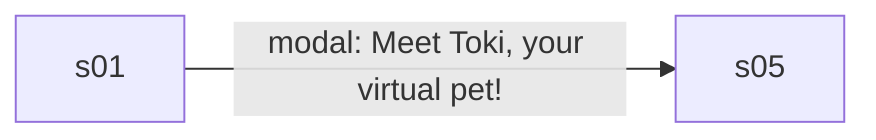
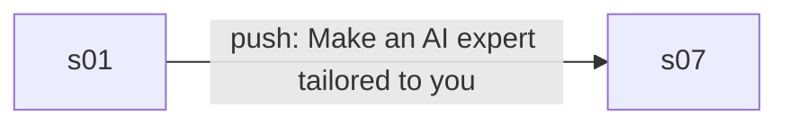

# Product model: Luzia 5.44.0

Category **chat** · 15 states · 33 edges · 6 core flows · run `20260929-204554-1f19585` · source `explorer_run`

## Navigation graph

## Core flows

### f1 Continue a chat and get a reply

Core loop: open a recent chat, type a message, send it, and receive an AI reply.

### f2 Browse personas and start a persona chat

Open the full persona list, return home, and start a chat with Teacher from the home shortcut.

### f3 Set up a routine

Go to Services and start a background routine (price watch, briefing, reminder) through a setup chat.

### f4 Explore and create mini apps

Open the Create tab, view a community app's detail, return, and start creating an app from a prompt.

### f5 Meet Toki virtual pet

Open the Toki promo card to see the virtual pet intro modal.

### f6 Create a Custom Bestie

Open the Custom Bestie promo to start building a personalized AI companion.

## States

| id | kind | name | rating | mock | elements | purpose |
|---|---|---|---|---|---|---|
| s01 | screen | Chats home | safe | yes | 45 | Main hub with a Luzia prompt bar, persona shortcuts, promo cards for Custom Bestie and Toki, and recent chats. Leads to persona chats, the full persona list, the Toki intro, and the Services and Create tabs. |
| s02 | screen | Services (Routines empty) | safe | yes | 19 | Empty Routines hub explaining that Luzia can shop, book or watch things for the user. Start something opens a routine setup chat; the bell opens notifications. |
| s03 | screen | Create – Explore apps | safe | yes | 22 | Catalog of AI-made mini apps with a recommended pick and trending cards. User opens an app detail, switches to My Apps, or taps Create app. |
| s04 | screen | New chat persona picker | unsafe | yes | 54 | Grid of AI personas (Luzia, Teacher, Friend, Chef, Intimate, Adult and more) plus Toki and Custom Bestie. User picks a persona to start a chat. |
| s05 | modal | Toki intro modal | safe | yes | 17 | Modal introducing Toki, a virtual pet that grows when cared for. User taps Meet me or Later, or closes it. |
| s06 | screen | Teacher chat thread | safe | yes | 28 | Existing chat with the Teacher persona where the user types or records messages and gets AI replies with feedback, copy, read aloud and share actions. |
| s07 | screen | Custom Bestie intro | safe | yes | 6 | Intro screen for creating a personalized AI companion. Let's get started begins creation; close returns home. |
| s08 | screen | Routine setup chat | safe | yes | 19 | Chat with Luzia to set up a background routine such as a price watch, briefing or date reminder, via suggestion chips or free text. |
| s09 | screen | Services (routines list) | safe | yes | 21 | Routines hub showing active routines, here one draft, with an Add new Routine button. |
| s10 | screen | Notifications – Services tab | safe |  | 17 | Notifications screen with Updates, Services and Activity tabs; the Services tab lists routines and offers Add new Routine. |
| s11 | screen | Create app prompt | safe | yes | 14 | User describes an app idea by text or voice, or picks a template to remix; creations become public once published. |
| s12 | screen | Create – My Apps | safe |  | 17 | The user's own apps list, empty here, with a Create app button and a switch back to Explore. |
| s13 | screen | App detail | safe | yes | 17 | Detail page of a community mini app (Photoedit) with Open app, like and save counts, share, remix and report. |
| s14 | screen | Create – Explore scrolled | safe | yes | 54 | Scrolled Explore catalog showing trending apps with counts and category filters (Hot, New, Creative, Arcade, Tools) over game cards. |
| s15 | screen | Teacher new chat | safe | yes | 16 | Fresh chat with the Teacher persona showing its greeting; the user types or records a question. |

## Mechanics

- **limit** (unknown) No message limit, paywall, or ad appeared in 3 passes of sending chat messages; plan of the account was not recorded, so a limit may exist beyond that. · evidence s06.e18, s06.e18>s06, s06.type>s06
- **other** (observed) Toki virtual pet that grows when the user cares for it, an engagement and return-visit hook promoted on home. · evidence s01.e26, s01.e27, s05.e04, s05.e06
- **other** (observed) Custom Bestie lets users build a personalized AI companion; promoted on home and in the persona picker. · evidence s01.e22, s01.e23, s07.e03, s07.e04
- **other** (observed) Routines: Luzia runs background tasks (price watching, daily briefings, reminders, shopping or booking) and posts updates to Services. · evidence s02.e08, s08.e02, s09.e09, s09.e10
- **other** (observed) User-generated mini app platform: users create apps by prompt or Remix an existing app, published creations are public, and apps are ranked with like and save counts. · evidence s11.e03, s11.e08, s13.e07, s13.e09, s13.e11, s13.e15, s14.e18, s14.e22 · numbers 2K, 1.4K, 1.3K, #1

## Value ledger

- actor: "By Luzia" · s13.e07
- actor: "Luzia is AI and can make mistakes. Creations are public once published." · s11.e08
- experience: "Core action over 3 passes (explore steps 69-77): reply started median 0.8 s (min 0.8, max 0.8, n=3); finished median 4 s (min 3.9, max 20.3, n=3); chars median 339 (min 95, max 366, n=3)" · s06.e18>s06, s06.type>s06
- experience: "After 3 passes of the core action nothing limited it: no limit, paywall, or ad appeared, on an account whose plan (free or paid) was not recorded (explore steps 69-77)" · s06.e18>s06, s06.type>s06

## App terms

- **Toki**: A virtual pet character the user creates and cares for so it grows. · defined by s01.e26, s01.e27, s05.e04 · through tap s01.e26>s05 · used in m2
- **Custom Bestie**: meaning not observed · used in m3
- **Routines**: meaning not observed · used in m4
- **Remix**: Start a new app based on an existing published app. · defined by s11.e03 · used in m5
- **Luzia**: meaning not observed · used in v1, v2

## Values shared across screens

- Draft routine status: Draft · s09.e10, s10.e10
- Photoedit like count: 2K · s13.e09, s14.e15
- Photoedit save count: 1.4K · s13.e11, s14.e17
- Recent chat name: Our new chat · s01.e34, s06.e28, s15.e16

## Open questions (for a targeted explore pass)

- q1 Is there a paid plan, and what does it cost and include? · start at s01, look for: A subscription or upgrade screen reached from the settings button or the Try Luzia label.
- q2 Does chat hit a message limit or paywall after more messages? · start at s06, look for: A limit banner, paywall, or ad after many more repeated messages.
- q3 Are the Intimate and Adult personas gated behind age checks or payment? · start at s04, look for: An age gate, lock, or upgrade prompt after tapping the Intimate or Adult card.
- q4 Is creating or publishing a mini app limited or paid? · start at s11, look for: A credit count, limit, or upgrade prompt after submitting an app idea.
- q5 Do routines have a cap or require a paid plan to activate? · start at s08, look for: A limit or upgrade message when finishing setup of a routine.
