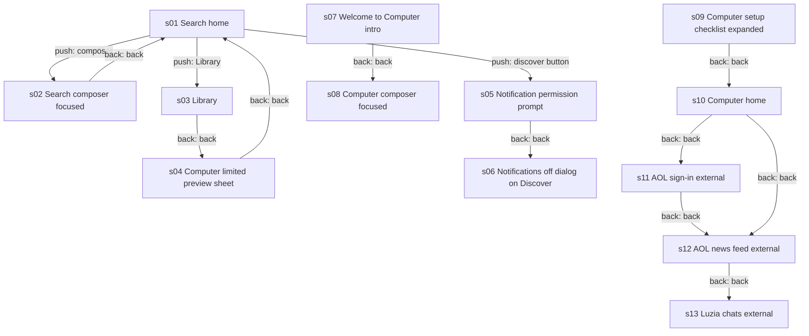
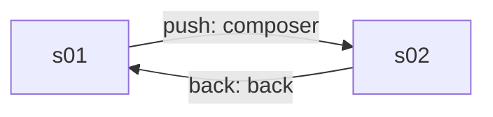
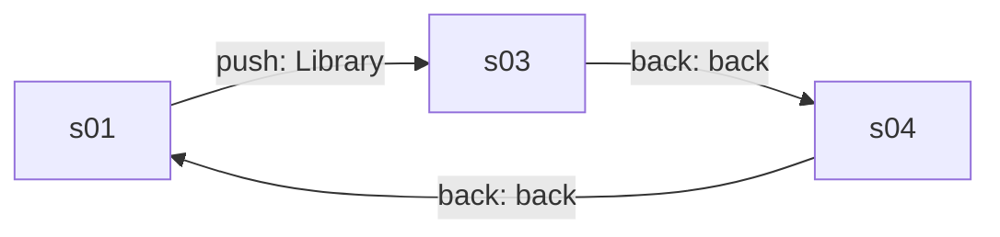
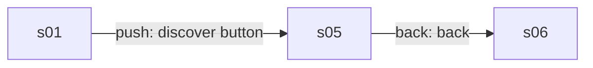
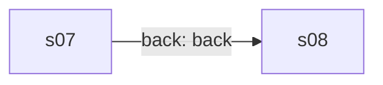
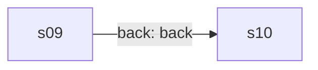

# Product model: Perplexity 2.100.0

Category **chat** · 13 states · 13 edges · 5 core flows · run `20260929-212810-1f19585` · source `explorer_run`

## Navigation graph

## Core flows

### f1 Ask a question

User taps the composer on the Search home to type a question, then backs out to home.

### f2 Library and Computer preview upsell

User opens the Library, and on leaving it is shown the Computer limited-preview sheet before returning home.

### f3 Discover with notification prompts

Opening Discover triggers the system notification prompt and then an in-app dialog asking to enable notifications.

### f4 Computer intro to composer

The Welcome to Computer intro is dismissed into the Computer-mode composer where the user can type a task.

### f5 Computer setup checklist

The expanded Set up Computer checklist is collapsed back to the Computer home showing its progress counter.

## States

| id | kind | name | rating | mock | elements | purpose |
|---|---|---|---|---|---|---|
| s01 | screen | Search home | safe | yes | 26 | Empty home screen with the Ask anything composer, Search/Computer mode toggle, model selector and voice buttons. Leads to the composer, the Library and Discover. |
| s02 | screen | Search composer focused | safe | yes | 27 | Home with the composer focused and a keyboard toolbar visible, ready to type a question. Back returns to home. |
| s03 | screen | Library | safe | yes | 19 | Account drawer listing Projects, Artifacts, Connectors and past Sessions, with a card to start a new Ask or Do session. Settings is at the top left. |
| s04 | screen | Computer limited preview sheet | safe | yes | 10 | Bottom sheet announcing that the Computer agent is available to try as a limited preview, with three benefit lines and a Get started button. Closing returns to home. |
| s05 | external | Notification permission prompt | safe |  | 8 | System dialog asking to allow Perplexity notifications, shown on opening Discover. Allow or Don't allow leads on to the Discover feed. |
| s06 | modal | Notifications off dialog on Discover | safe |  | 13 | In-app dialog over the Discover news feed asking the user to turn on notifications in system settings. Cancel dismisses to the feed. |
| s07 | screen | Welcome to Computer intro | safe | yes | 9 | Full-screen intro telling the user they have a limited preview of Computer. Get started or Skip intro leads to the Computer composer. |
| s08 | screen | Computer composer focused | safe | yes | 22 | Home in Computer mode with the Do anything composer focused for typing a task. |
| s09 | screen | Computer setup checklist expanded | safe | yes | 34 | Computer mode home with the Set up Computer checklist expanded: connect apps, start a first task, turn on notifications. Collapsing returns to the plain Computer home. |
| s10 | screen | Computer home | safe | yes | 23 | Home in Computer mode with a collapsed setup checklist and the Do anything composer. Back exits the app. |
| s11 | external | AOL sign-in (external) | safe |  | 15 | Another app's sign-in page reached after backing out of Perplexity; not part of the app. |
| s12 | external | AOL news feed (external) | mixed |  | 107 | Another app's news feed with headlines and a Taboola ad, reached after leaving Perplexity; not part of the app. |
| s13 | external | Luzia chats (external) | safe |  | 48 | A different chat app's home screen reached after leaving Perplexity; not part of the app. |

## Mechanics

- **entitlement** (observed) The Computer agent mode is granted as a limited preview; a sheet and an intro screen tell the user it is available to try, with benefit lines and a Get started button. · evidence s04.e04, s04.e05, s07.e02, s04
- **limit** (inferred) 'Limited preview' implies Computer use is capped (by tasks, time or credits), but no cap, counter or upgrade price was shown. The core action was not repeated, so no limit was observed. · evidence s04.e04, s07.e02
- **other** (observed) Onboarding checklist for Computer (connect apps, start first task, turn on notifications) with a progress counter, pushing activation and notification opt-in. · evidence s09.e02, s09.e03, s09.e30, s09.e32, s09.e34, s10.e03 · numbers 0 of 3
- **other** (observed) Notification opt-in: system permission prompt on Discover, followed by an in-app dialog asking the user to enable notifications for daily threads. · evidence s05.e06, s06.e02, s06.e03, s06.e05
- **entitlement** (unknown) A Model selector in the composer lets the user choose the AI model; whether some models require a paid plan was not captured. · evidence s01.e18, s01.e20

## Value ledger

- limit: "LIMITED PREVIEW" · s04.e04
- limit: "You have access to a limited preview of Computer, your always-on teammate that works for you." · s07.e02
- paywall_bullet: "Hand off complex tasks and get polished results" · s04.e06
- paywall_bullet: "Work across all your connected apps and tools" · s04.e07
- paywall_bullet: "Automate recurring tasks on any schedule" · s04.e08
- meter: "0 of 3 completed" · s09.e03

## App terms

- **Computer**: Perplexity's agent mode that carries out multi-step tasks across connected apps and on schedules, rather than just answering a question. · defined by s07.e02 · used in m1, m2, m3, l2, l3, l4, l5
- **Limited preview** (everyday word, never flagged): meaning not observed · used in m1, m2, l1, l2
- **Model** (everyday word, never flagged): meaning not observed · used in m5

## Values shared across screens

- Computer setup progress: 0 of 3 completed · s09.e03, s09.e27, s10.e03

## Open questions (for a targeted explore pass)

- q1 What exactly limits the Computer limited preview, and what plan or price unlocks full access? · start at s04, look for: A usage counter, credit balance or upgrade screen with prices after tapping Get started and running tasks.
- q2 Is there a paid subscription and what does it cost? · start at s03, look for: A subscription or plan row with prices inside Settings from the Library.
- q3 Are some models behind a paid plan? · start at s01, look for: Lock icons or upgrade labels in the list that opens from the Model selector.
- q4 Does repeated asking in Search hit a daily limit on advanced searches? · start at s01, look for: A limit banner or upgrade prompt after sending many questions in a row.
- q5 What happens when the Computer setup checklist is completed or a first task is started? · start at s09, look for: Any reward, credit grant or upgrade prompt after completing the three checklist items.
